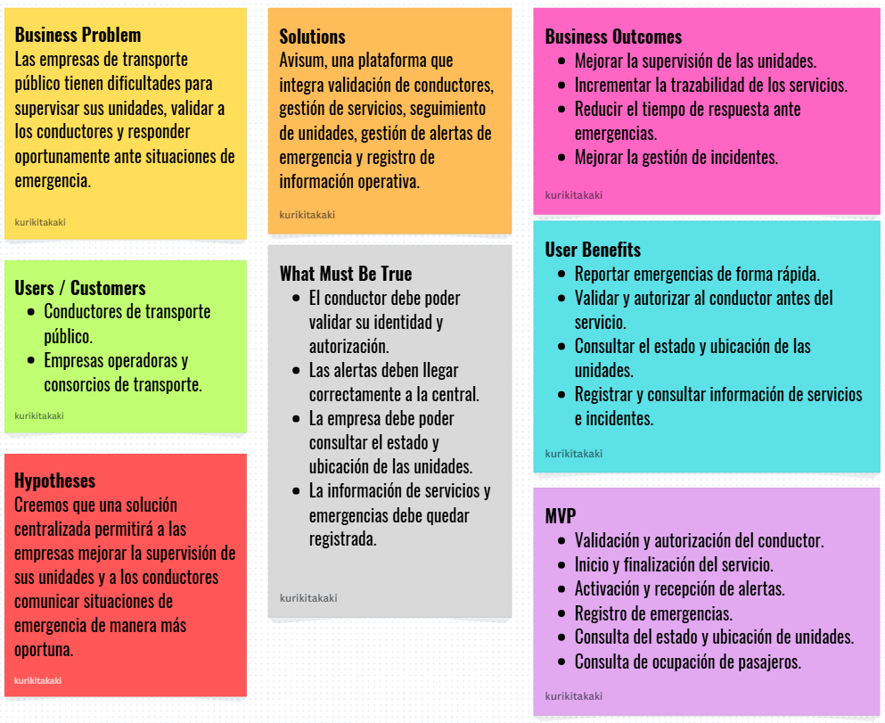

# Capitulo I: Introducción
## 1.1. Startup Profile
## 1.1.1. Descripción de la Startup

**UrbanGuard** es una startup peruana de tecnología orientada a fortalecer la seguridad y trazabilidad en el transporte público urbano. Surge ante la problemática de inseguridad que enfrentan diariamente los conductores y las empresas operadoras, especialmente ante situaciones como accidentes, asaltos y otras emergencias durante el servicio. Asimismo, la falta de mecanismos tecnológicos para validar la identidad y autorización de los conductores, realizar el seguimiento de las unidades y gestionar alertas dificulta la supervisión y la respuesta oportuna ante incidentes.

Nuestra propuesta tecnológica es **Avisum**, una solución orientada a la gestión y monitoreo de la seguridad de las unidades de transporte público. El sistema articula los siguientes pilares:

- Validación y autorización del conductor: permite verificar la identidad y autorización del conductor antes de iniciar el servicio, además de asociarlo con el vehículo correspondiente.
- Gestión de servicios: registra el inicio y finalización de cada servicio, manteniendo la trazabilidad de la operación.
- Gestión de emergencias: permite al conductor activar una alerta durante un servicio activo, notificando a la central para facilitar la activación del protocolo de atención. Las alertas pueden ser registradas, clasificadas y asociadas con la ubicación del evento.
- Seguimiento de unidades: permite consultar el estado y la ubicación de los vehículos durante el servicio.
- Gestión de ocupación: contempla el registro y consulta de la cantidad de pasajeros a bordo, considerando alternativas tecnológicas de sensado cuya viabilidad es evaluada durante el proyecto.

**MISIÓN:** Fortalecer la seguridad y trazabilidad del transporte público mediante una solución tecnológica que permita validar conductores, supervisar unidades, gestionar emergencias y disponer de información oportuna para la atención y seguimiento de incidentes.

**VISIÓN:** Convertirnos en una solución tecnológica referente en seguridad y trazabilidad para el transporte público, contribuyendo a una gestión más eficiente de las unidades, una respuesta más oportuna ante emergencias y una mayor confianza en el sistema de movilidad urbana.

<h3>Perfiles de integrantes de la Startup</h3>

|Foto de Perfil|Descripción|
| :--: | :-- |
|  |Nombre: **Ivonne Beatriz Ibañez Torres** Carrera: Ingeniería de Software Codigo: U20241A995  Descripción: Estudiante de sexto ciclo de Ingeniería de Software con conocimientos en programación con C++ y Python, diseño y patrones de software, gestión de bases de datos con PostgreSQL y MongoDB, y desarrollo backend con Java, Spring Boot y Node.js. Cuenta con interés en el diseño de soluciones de software y en la implementación de aplicaciones eficientes y escalables. |
|  |Nombre: **Carlos Franco Blancas Chavez** Carrera: Ingeniería de Software Codigo: U20241A322  Descripción: Estudiante de sexto ciclo con conocimientos en C++, HTML, CSS, MySQL, Python (basics) y C# (basics) |
| |Nombre: **Kevin Edu Lopez Montalvo** Carrera: Ingeniería de Software Codigo: U20241D958  Descripción: Estudiante de sexto ciclo de Ingeniería de Software con conocimientos en desarrollo FullStack, integración de componentes frontend y backend, control de versiones mediante Git y gestión de bases de datos. Posee interés en la construcción de aplicaciones web completas, trabajando de manera colaborativa y aplicando buenas prácticas durante el proceso de desarrollo. |
|  |Nombre: **Boris Alvarado Millan** Carrera: Ingeniería de Software Codigo: U20241B676  Descripción: Estudiante de sexto ciclo con conocimientos en Java, Html, Css, JavaScript, Angular, Vue, Node.js, TypeScript, TailwindCss, Spring, C++ y Python |
|  |Nombre: **Nadhim Abigail Raymundo Villarroel** Carrera: Ingeniería de Software Codigo: U202318001  Descripción: Estudiante de sexto ciclo de Ingeniería de Software, experiencia con bases de datos relacionales y no relacionales (MySQL, PostgreSQL, MongoDB), control de versiones con Git/GitHub aplicando GitFlow, y contenedores con Docker, HTML, CSS, JavaScript, TypeScript, C++ y Python. |

_Tabla 1. Perfiles de integrantes de equipo - Elaboración propia_

## 1.2. Solution Profile
### 1.2.1. Antecedentes y problemática

Para comprender las necesidades de los usuarios y delimitar el problema que aborda Avisum, se aplicó la técnica 5W's & 2H's, la cual permite caracterizar la problemática a partir de siete preguntas clave.

**What (Qué)**
- ¿Cuál es el problema?

La problemática identificada corresponde a la falta de mecanismos tecnológicos que permitan mejorar la seguridad y trazabilidad del transporte público urbano. Actualmente, las empresas operadoras pueden tener dificultades para conocer en tiempo real qué conductor está operando cada unidad, cuál es su estado y dónde se encuentra durante el servicio. Asimismo, ante una situación de emergencia, se requiere un mecanismo que permita al conductor enviar una alerta a la central de operaciones y realizar el seguimiento del evento.

A esto se suma la necesidad de disponer de información sobre la cantidad de pasajeros a bordo, debido a que este dato puede ser relevante para la gestión y atención de situaciones de emergencia. Por ello, Avisum propone integrar la validación y autorización del conductor, el registro de inicio y finalización del servicio, el seguimiento de las unidades, el conteo de pasajeros y la gestión de alertas de emergencia.

**When (Cuándo)**
- ¿Cuándo sucede el problema?

La inseguridad en el transporte público urbano del Perú. Los pasajeros no tienen forma de verificar si el conductor del vehículo en el que abordan es la persona autorizada para operar esa unidad. A esto se suma la inexistencia de mecanismos de alerta en tiempo real para el conductor ante situaciones de riesgo (asaltos, accidentes, emergencias médicas) y la falta de registro de cuántas personas se encuentran a bordo, dato crítico para la gestión de emergencias.

- ¿Cuándo utilizará el cliente el producto?

El problema se manifiesta en cada servicio de transporte público: al momento de abordar la unidad (sin posibilidad de verificar al conductor), durante el trayecto (sin canal de alerta ante emergencias) y en la gestión de incidentes por parte de las autoridades (sin información del número de pasajeros a bordo). Los accidentes de tránsito y asaltos al transporte público ocurren en cualquier momento del día, con mayor incidencia en horarios nocturnos

**Where (Dónde)**
- ¿Dónde está el cliente cuando usa el producto?

En su jornada laboral, conduciendo en medio del viaje

- ¿Dónde surge el problema?

En el norte del Perú (Trujillo, Chiclayo, Piura) hace casi dos décadas. Extendiéndose a zonas céntricas de Lima

**Who (Quién)**
- ¿A quiénes les sucede el problema?

A los pasajeros del transporte público (especialmente mujeres, adultos mayores y escolares), a los conductores expuestos a asaltos, extorsiones, a las empresas operadoras de transporte que no tienen visibilidad de sus unidades en tiempo real, y a las autoridades de seguridad y emergencias que necesitan datos precisos al atender incidentes viales. 

**Why (Por qué)**
- ¿Cuál es la causa del problema?

Por la ausencia de tecnología de identificación y trazabilidad en las unidades de transporte público. Las empresas operadoras carecen de plataformas digitales que les permitan verificar en tiempo real quién conduce cada unidad. Tampoco existen canales de emergencia directos entre el conductor y la central de operaciones, ni sensores para el conteo de pasajeros. 

**How (Cómo)**
- ¿Cómo afecta este problema?

La combinación de informalidad en el sector, débil regulación tecnológica y la ausencia de estándares digitales de seguridad en el transporte genera un entorno donde cualquier persona puede operar una unidad sin trazabilidad. Ante una emergencia, el conductor no tiene mecanismos de alerta efectivos y las autoridades responden a ciegas. Mediante Violencia y Muerte, Aumento de Pasajes, Inseguridad Ciudadana, Aumento del Transporte Informal, hasta impacto psicológico.

**How Much (Cuánto)**
- ¿Qué datos respaldan la problemática?

_Según el MTC (2023)_, en el Perú se registran más de 90,000 accidentes de tránsito anuales, de los cuales aproximadamente el 30% involucra unidades de transporte público. Lima concentra el mayor número de incidentes. Adicionalmente, la Defensoría del Pueblo reporta que el 68% de mujeres ha sufrido algún tipo de acoso o situación de inseguridad en el transporte público. La falta de información en tiempo real sobre los conductores y la cantidad de pasajeros prolonga los tiempos de respuesta de emergencia y aumenta el número de víctimas
Aproximadamente el 40% de empresas de transporte en Lima y Callao pagan cupos, según gremios. 

### 1.2.2. Lean UX Process
El Lean UX Process permite definir la visión del producto a partir de las necesidades identificadas en el dominio del transporte público, considerando los principales segmentos de usuarios, sus puntos de dolor, las oportunidades de mejora y los resultados esperados. A partir de este proceso se establecen los Problem Statements, Assumptions e Hypothesis Statements que orientan el desarrollo de Avisum y permiten validar si la solución propuesta responde adecuadamente a la problemática identificada.

#### 1.2.2.1. Lean UX Problem Statements.
**Problem Statement 1:** Los conductores de transporte público enfrentan situaciones de riesgo como robos, agresiones y extorsiones durante sus recorridos diarios. Actualmente, muchas unidades no cuentan con mecanismos digitales que permitan reportar incidentes de manera inmediata ni solicitar apoyo oportunamente, lo que dificulta la comunicación con la central de operaciones y la respuesta ante situaciones de emergencia.

**Problem Statement 2:** Las empresas operadoras de transporte presentan una limitada capacidad de supervisión sobre sus unidades mientras se encuentran en operación. Esta falta de visibilidad dificulta conocer qué conductor está asociado a cada unidad, cuál es el estado del servicio y dónde se encuentra el vehículo, reduciendo su capacidad para tomar decisiones oportunas y responder adecuadamente ante incidentes o emergencias.

**Problem Statement 3:** Las empresas operadoras necesitan disponer de información confiable sobre sus servicios y unidades para mejorar la trazabilidad de sus operaciones. La ausencia de registros centralizados sobre conductores, inicio y finalización de servicios, alertas de emergencia, ubicación y ocupación de las unidades dificulta el seguimiento de los eventos y el análisis posterior de incidentes.

#### 1.2.2.2. Lean UX Assumptions.

**Business Assumptions:**
- Creemos que las empresas operadoras de transporte público necesitan herramientas digitales que les permitan supervisar sus unidades y gestionar incidentes de seguridad de manera oportuna.
- Suponemos que las empresas estarían dispuestas a adoptar una solución tecnológica si esta contribuye a mejorar la trazabilidad de sus operaciones y el control sobre sus unidades.
- Consideramos que la implementación de Avisum puede mejorar la comunicación entre los conductores y la central de operaciones durante situaciones de emergencia.
- Creemos que centralizar la información relacionada con conductores, servicios, unidades y alertas facilitará la supervisión y la toma de decisiones por parte de las empresas operadoras.

**Business Outcomes:**
- Reducir el tiempo de respuesta ante incidentes reportados por los conductores.
- Mejorar la capacidad de supervisión de las empresas sobre sus unidades en operación.
- Incrementar la trazabilidad de los servicios realizados por cada unidad y conductor.
- Mejorar la gestión y seguimiento de las alertas de emergencia.

**User Benefits:**
- Los conductores podrán enviar alertas de emergencia de manera rápida durante un servicio activo.
- Los conductores podrán validar su identidad y autorización antes de iniciar un servicio.
- Los supervisores podrán consultar información relacionada con el estado y ubicación de las unidades.
- Las empresas podrán consultar y mantener registros de los servicios y eventos de emergencia para facilitar su seguimiento y análisis.
- La información sobre la ocupación de las unidades podrá apoyar la gestión de situaciones de emergencia.

#### 1.2.2.3. Lean UX Hypothesis Statements.
**Hypothesis Statement 1:** Creemos que al implementar una funcionalidad de activación y gestión de alertas de emergencia, los conductores podrán comunicar situaciones de riesgo a la central de operaciones de manera más rápida y oportuna. Sabremos que esto es cierto cuando los conductores puedan generar una alerta durante un servicio activo y la central pueda recibir, registrar y confirmar su recepción correctamente.

**Hypothesis Statement 2:** Creemos que al proporcionar información sobre el estado y ubicación de las unidades, las empresas operadoras podrán mejorar la supervisión de sus vehículos durante el servicio. Sabremos que esto es cierto cuando la empresa pueda consultar correctamente el estado y la ubicación de una unidad activa mediante el sistema.

**Hypothesis Statement 3:** Creemos que al implementar mecanismos de validación y autorización del conductor antes del inicio del servicio, las empresas podrán mejorar la trazabilidad de sus operaciones. Sabremos que esto es cierto cuando el sistema pueda validar al conductor, verificar su autorización, asociarlo con el vehículo correspondiente y registrar el inicio del servicio.

**Hypothesis Statement 4:** Creemos que al centralizar el registro de alertas, ubicaciones y servicios, las empresas podrán realizar un mejor seguimiento de los incidentes ocurridos durante la operación. Sabremos que esto es cierto cuando el sistema pueda almacenar las alertas generadas, registrar su información relevante y permitir la consulta de su historial.

#### 1.2.2.4. Lean UX Canvas.

_Figura 1. Lean UX Canvas_

## 1.3. Segmento Objetivo
| Segmento objetivo | Características demográficas | Información estadística de sustento |
|:--: | :--: | :--: |
| **Conductores** (operarios) de transporte público | Cantidad de vehículos: Uno o 2 a su disposición. Edad: Adultos de 24 años en adelante.  Cargo: Conductores con vehículo asignado a una empresa-ruta.  Ubicación: Lima Metropolitana y el Callao.  Interés: Garantizar su bienestar y el de los pasajeros a bordo. | Según Panamericana.pe (2025), los conductores deben pagar una cuota diaria y semanal para poder operar. Si alguien se niega, corre el riesgo de ser atacado a balazos. |
| Empresas o **consorcios de transporte público** | Cantidad de vehículos: Más de 2 a nombre del consorcio.  Edad: Adultos de 28 años a más.  Cargo: Representantes legales de consorcios con operarios de cústers.  Ubicación: Lima Metropolitana y Callao.  Interés: Garantizar la seguridad de pasajeros y operarios. | De acuerdo con larepublica.pe (2024), más de 14,000 denuncias por extorsión han sido registradas en todo el país, destacándose Lima y La Libertad como las regiones más afectadas. |
