## 2.1. Competidores
Comprender el entorno competitivo resulta clave para el posicionamiento de cualquier modelo de negocio digital. En esta sección se realiza un análisis de los competidores de SafeBus, tanto directos como indirectos, evaluando las estrategias que aplican, así como sus principales fortalezas y debilidades frente a la propuesta de monitoreo y seguridad en tiempo real para transporte público del negocio.

### 2.1.1. Análisis competitivo
Llevar a cabo un análisis competitivo es clave para reconocer oportunidades y riesgos en el mercado, así como para posicionar a SafeBus de manera estratégica. Este análisis permite comprender cómo los competidores atienden las necesidades de conductores, pasajeros y empresas de transporte, identificar vacíos en el mercado y destacar nuestra solución a través de ventajas diferenciadoras como la cámara de vigilancia 360°. También facilita la elaboración de estrategias más efectivas de marketing, precios y distribución, garantizando una propuesta de valor sólida y sostenible frente a la inseguridad y la extorsión que afecta al sector.

<table>
    <tr>
       <td colspan="6" class="sub"><h1>Competitive Analysis Landscape</h1></td>
    </tr>
    <tr>
        <td colspan="2" rowspan="2" class="sub">¿Por qué llevar a cabo este análisis?</td>
        <td colspan="4" class="sub"><h3>¿Quiénes son nuestros principales competidores?</h3></td>
    </tr>
    <tr>
        <td colspan="4">Identificar ventajas competitivas frente a soluciones existentes en el mercado de seguridad para transporte público. Este análisis permite comprender cómo los competidores atienden la necesidad de seguridad de conductores, pasajeros y empresas de transporte, identificar vacíos en el mercado y destacar a SafeBus a través de una ventaja diferenciadora: la cámara de vigilancia 360° integrada a la unidad, junto con el botón de pánico y el conteo de pasajeros, ante la ausencia de un sistema que combine estos tres elementos en una sola plataforma dentro del transporte público tradicional.</td>
    </tr>
    <tr>
    <td rowspan="3" class="sub">PERFIL</td>
    <td rowspan="2" class="sub">Overview</td>
<td> Avisum </td>
<td> Metropolitano 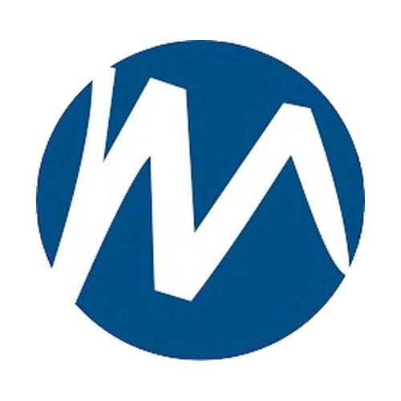</td>
<td> RTP </td>
<td> Mi Transporte 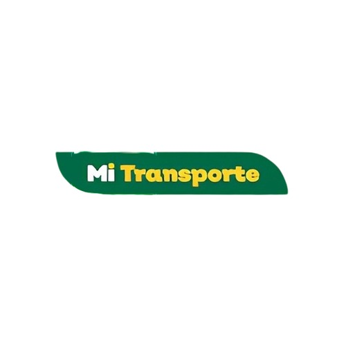</td>
</tr>
    <tr>
        <td>Sistema de seguridad instalado directamente en unidades de transporte público tradicional (cústers, combis), que integra cámara de vigilancia 360°, botón de pánico y conteo de pasajeros en una sola plataforma, sin depender de infraestructura vial fija.</td>
        <td>Sistema de transporte masivo tipo BRT (Bus Rapid Transit) que opera bajo infraestructura de estaciones, carriles exclusivos y rutas troncales definidas en Lima Metropolitana.</td>
        <td>Sistema de transporte público que incorpora cámaras de seguridad y monitoreo en tiempo real en sus unidades, con personal capacitado en protocolos de seguridad.</td>
        <td>Plataforma de transporte multimodal con seguimiento en tiempo real y canal de reportes ciudadanos ante incidentes.</td>
    </tr>
    <tr>
        <td class="sub">Ventaja Competitiva ¿Qué valor ofrece a los clientes?</td>
        <td>Monitoreo en tiempo real, botón de emergencia con conteo de pasajeros por sensores en la puerta.</td>
        <td>Infraestructura organizada, estaciones, rutas definidas, carriles exclusivos y cámaras de videovigilancia.</td>
        <td>Tecnología incorporada: cámaras de seguridad, monitoreo en tiempo real y capacitación del personal.</td>
        <td>Monitoreo y protocolos de seguimiento en tiempo real, reportes ciudadanos.</td>
    </tr>
    <tr>
        <td rowspan="2" class="sub">PERFIL DEL MARKETING</td>
        <td class="sub">Mercado Objetivo</td>
        <td>Consorcios/empresas de transporte público y operarios de vehículos asignados.</td>
        <td>Usuarios urbanos de Lima Metropolitana.</td>
        <td>Población de zonas periféricas, estudiantes y grupos vulnerables.</td>
        <td>Población de zonas periféricas y estudiantes.</td>
    </tr>
    <tr>
        <td class="sub">Estrategias de Marketing</td>
        <td>Enfatiza la seguridad durante la ruta con un sistema integrado al vehículo.</td>
        <td>Servicio rápido, moderno, formal y seguro, destacando eficiencia y orden.</td>
        <td>Campaña "Yo Soy RTP", sustentabilidad con unidades eléctricas.</td>
        <td>Posiciona el transporte como sistema integrado, moderno y eficiente.</td>
    </tr>
    <tr>
        <td rowspan="3" class="sub">PERFIL DEL PRODUCTO</td>
        <td class="sub">Productos & Servicios</td>
        <td>Botón de pánico, información sobre paraderos, monitoreo de riesgos 24h.</td>
        <td>Transporte troncal, tarjeta recargable, estaciones seguras, información de rutas.</td>
        <td>Servicio ordinario, expreso, Ecobús y Nochebús.</td>
        <td>Transporte multimodal, Tarjeta Mi Movilidad, App Mi Saldo, Mi Pasaje.</td>
    </tr>
    <tr>
        <td class="sub">Precios & Costos</td>
        <td>Desde S/. 99 por unidad/mes incluyendo instalación. 20% de descuento a partir de 3 unidades.</td>
        <td>S/. 3.50 por viaje.</td>
        <td>40 céntimos (ordinario) a 1.50 soles (Nochebús).</td>
        <td>Tarifa plana S/. 2.00, tarifa preferencial S/. 1.00.</td>
    </tr>
    <tr>
        <td class="sub">Canales de distribución (web/móvil)</td>
        <td>Web y móvil.</td>
        <td>Web, móvil/recarga digital, puntos físicos.</td>
        <td>App CDMX, tarjeta de movilidad integrada, sitio web oficial.</td>
        <td>Web, móvil (App Mi Saldo), puntos físicos (OXXO, estaciones).</td>
    </tr>
    <tr>
        <td rowspan="4" class="sub">ANÁLISIS SWOT</td>
        <td class="sub">Fortalezas</td>
        <td>Equipo profesional comprometido con el bienestar del cliente.</td>
        <td>Marca reconocida, sistema formal, modernización digital.</td>
        <td>Tarifas sociales subsidiadas, flota moderna eléctrica, conductores capacitados.</td>
        <td>Marca unificada, interoperabilidad, modernización de flota.</td>
    </tr>
    <tr>
        <td class="sub">Debilidades</td>
        <td>Startup nueva, sin base de usuarios ni reputación instalada; depende de que empresas y conductores adopten un dispositivo físico adicional a la unidad.</td>
        <td>Infraestructura fija limita su alcance a rutas troncales; no cubre el transporte tradicional informal donde ocurre la mayor extorsión.</td>
        <td>Las cámaras están orientadas a videovigilancia general del servicio, no a la protección activa del conductor ante extorsión.</td>
        <td>Depende de que el propio pasajero reporte el incidente; no genera evidencia automática desde dentro de la unidad.</td>
    </tr>
    <tr>
        <td class="sub">Oportunidades</td>
        <td>Expansión a provincias, acuerdos formales con la policía.</td>
        <td>Expansión urbana, digitalización del servicio.</td>
        <td>Expansión de rutas eléctricas para el Mundial 2026.</td>
        <td>Crecimiento urbano hacia otros estados, crisis de combustibles.</td>
    </tr>
    <tr>
        <td class="sub">Amenazas</td>
        <td>Alto índice de extorsiones a transportistas en sus rutas.</td>
        <td>Inseguridad ciudadana, saturación en horas punta, fallas operativas.</td>
        <td>Competencia del transporte concesionado informal, congestión vial.</td>
        <td>Resistencia al cambio, inseguridad, incidentes de vandalismo.</td>
    </tr>
</table>

#### 2.1.2. Estrategias y tácticas frente a competidores.

Entre las principales estrategias y tácticas que ejecutaremos como startup son las siguientes:

Por un lado, estas son las estrategias preliminares:

- Diferenciación mediante una cámara de vigilancia 360° integrada a la unidad junto con botón de pánico y conteo de pasajeros, cubriendo lo que Metropolitano y RTP ofrecen solo de forma parcial (videovigilancia general orientada al servicio, no a la protección activa del conductor).
- Cobertura de rutas y transporte informal no atendidas por competidores con infraestructura fija, como Metropolitano, aprovechando la oportunidad de expansión hacia este segmento desatendido.
- Implementación colaborativa con conductores y empresas de transporte, para reducir la resistencia al cambio identificada por el bajo nivel de adopción tecnológica del sector.
- Alianzas con autoridades, municipalidades y entidades de seguridad, en respuesta a la amenaza de baja respuesta policial reportada por conductores y empresas en las entrevistas.

Por otro lado, estas son nuestras tácticas específicas:

- Programa de capacitación y soporte técnico continuo para conductores y empresas, con material simple orientado a personas con conocimientos digitales limitados.
- Piloto gratuito o descuento por volumen de unidades, dirigido a consorcios y empresas formales de transporte.
- Políticas claras y visibles de almacenamiento, retención y acceso a las grabaciones de la cámara 360°, posicionándola ante los conductores como un respaldo ante denuncias falsas o conflictos con pasajeros, y no solo como una herramienta de control sobre ellos.
- Reportes automáticos de reducción de incidentes y extorsión, que faciliten a las empresas la decisión de renovar o expandir el servicio.
- Campaña de referidos entre conductores, aprovechando el canal de WhatsApp que ya usan hoy para alertarse de zonas de riesgo, para impulsar la adopción boca a boca.

### 2.2 Entrevistas
#### 2.2.1 Diseño de entrevistas

**User: Conductores (operarios) de transporte público**

1. ¿Cómo es un día típico para ti desde que inicias hasta que terminas tu jornada manejando?
2. ¿En qué momentos del día te sientes más expuesto al peligro, o inseguro mientras trabajas?
3. ¿Qué tan frecuente es que los conductores reciban amenazas o presiones externas como cobros o extorsión?
4. ¿Qué herramientas o medidas de seguridad tienes actualmente en tu unidad?
5. ¿Qué tan importante crees que es que alguien esté monitoreando lo que pasa en tu unidad en tiempo real?
6. ¿Qué tan rápido puedes pedir ayuda actualmente si pasa algo dentro del vehículo?
7. ¿Qué cosas sientes que faltan para que tu trabajo sea más seguro?
8. ¿Qué tan cómodo te sentirías con una cámara de vigilancia 360° dentro de tu unidad que grabe todo el interior del bus mientras trabajas?
9. ¿Te preocuparía que esa cámara también te grabe a ti, o lo verías como algo que te protege en caso de una denuncia falsa o un conflicto con un pasajero?
10. ¿Qué tan cómodo te sentirías usando una app que monitoree tu ubicación y seguridad antes de iniciar tu jornada laboral?
11. Tratándose de una herramienta digital, ¿qué opinas de tener que validar tu identidad (por ejemplo con QR) antes de manejar?
12. ¿En qué momento del día usarías más una solución como esta (app + cámara)?

**User: Empresas o consorcios de transporte público**

1. ¿Cómo gestionan actualmente la seguridad de sus conductores y pasajeros?
2. ¿Cuáles son los principales problemas de seguridad que enfrentan hoy en día?
3. ¿Qué tan frecuente es enfrentar situaciones como extorsión, robos o incidentes dentro de las unidades?
4. ¿Qué impacto tienen estos problemas en su operación (costos, reputación, continuidad del servicio)?
5. Cuando ocurre una emergencia, ¿cómo se enteran y qué tan rápido pueden actuar?
6. ¿Qué tan difícil es supervisar en tiempo real lo que sucede en cada unidad durante la jornada?
7. ¿Actualmente cuentan con algún sistema de cámaras dentro de las unidades? ¿Qué limitaciones tiene (cobertura, calidad, almacenamiento)?
8. ¿Qué tan útil sería contar con una cámara de vigilancia 360° dentro de cada unidad, que permita ver todo el interior en tiempo real o revisar la grabación ante un incidente?
9. ¿Cómo creen que reaccionarían sus conductores ante la instalación de una cámara así? ¿Qué les preocuparía a ustedes sobre el manejo de esas grabaciones (privacidad, almacenamiento, quién tiene acceso)?
10. ¿Cómo verifican actualmente que el conductor asignado al vehículo sea el correcto?
11. ¿Han tenido problemas relacionados con conductores no autorizados o mala identificación?
12. Haciendo uso de una herramienta digital en tiempo real, ¿qué aspectos podrían ayudarte a mejorar?
13. Si se implementara este sistema (app + cámara 360°), ¿qué necesitarían o qué les preocuparía antes de usarlo?

#### 2.2.2 Registro de entrevista

<h3>User: Conductores (operarios) de transporte público</h3>

**Entrevistado 1: Isaac Diaz**
Edad: 24 años
Distrito: Los Olivos
Link del video: https://1drv.ms/v/c/470edfbbf4f38077/IQAgxwp_SW22QpjqP_2LFiWSAdYBHohGYuGkvqzhTnHDw3Q?e=p0gfr4

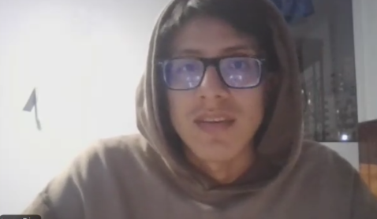

**Resumen de la entrevista:** Isaac inicia su jornada a las 4 a.m. y termina pasadas las 10 p.m., enfrentando mayor sensación de inseguridad durante las noches, especialmente en zonas como El Agustino y Caquetá. Señala que las extorsiones y cobros de cupos son prácticamente cotidianos, con amenazas físicas hacia quienes se niegan a pagar. En cuanto a seguridad, su unidad cuenta apenas con una cámara de baja calidad, sin ningún otro mecanismo de protección por parte de la empresa. Ante una emergencia, reconoce que pedir ayuda es muy lento y complicado, ya que depende únicamente de su celular personal. Considera fundamental contar con monitoreo en tiempo real, un botón de pánico y registro del número de pasajeros a bordo. Mostró total disposición a usar una aplicación de seguridad, incluyendo la validación de identidad por QR, viéndola como una medida que ordena y protege la operación. Usaría la solución principalmente en el turno nocturno y al inicio de cada jornada. 

**Entrevistado 2: Elverth Vasquez**
Edad: 24 años
Distrito: Ate
Link del video: https://1drv.ms/v/c/470edfbbf4f38077/IQDZPsCISt-yTYTs5S4l8HeaAQpjL1ZLpmaajFW__S6ceEI?e=qO2gok

**Resumen de la entrevista:** Elverth inicia su jornada a las 4:30 a.m. y culmina cerca de las 9 p.m., realizando entre 4 y 5 vueltas diarias. Identifica zonas como Zárate y La Victoria como los puntos de mayor riesgo durante su ruta nocturna. Señala que los cobros de cupo ocurren dos veces por semana de manera casi normalizada, asumiendo esta presión como parte inevitable del trabajo. En cuanto a seguridad, cuenta únicamente con una cámara en mal estado sin ningún respaldo adicional por parte de la empresa. Reconoce que pedir ayuda en una emergencia es peligroso e ineficiente, ya que debe llamar por celular mientras conduce. Considera prioritario contar con un botón de alerta directa que no requiera comunicación verbal, y también señala la falta de respuesta policial como un problema estructural que agrava su situación. Mostró total disposición a usar una aplicación de monitoreo y valoró positivamente la validación por QR, viéndola como una medida que también lo protege a él ante posibles suplantaciones. Usaría la solución principalmente en horario nocturno y al transitar por zonas de alto riesgo que ya tiene identificadas en su ruta. 

**Entrevistado 3: Margarita Nuñez** 
Edad: 34
Distrito: Ate
Link del video: https://1drv.ms/v/c/470edfbbf4f38077/IQCDEnBDbQFuT5alyi7S1O1rAc_Amy-5v-hK0TdLZh5oRWs?e=ee2m7X

**Resumen de la entrevista:** Margarita combina su jornada laboral de 6 a.m. a 8 p.m. con sus responsabilidades como madre, dejando a sus hijos al cuidado de su mamá antes de salir cada día. Identifica el riesgo no solo en horario nocturno sino a lo largo de toda la jornada, señalando que como mujer conductora enfrenta una exposición mayor a intimidaciones y acoso dentro de su propia unidad. Indica que en su ruta se cobra cupo semanalmente y que su condición de mujer la hace blanco más fácil de presión por parte de los extorsionadores. En cuanto a seguridad, no cuenta con ningún mecanismo real de protección, dependiendo únicamente de un número telefónico de la empresa que raramente responde a tiempo. Destaca como necesidad prioritaria una alarma silenciosa que no sea visible para el agresor, ya que activar una alerta de forma obvia podría empeorar la situación. Mostró la mayor disposición de los tres entrevistados hacia el uso de la aplicación, afirmando que la usaría desde el primer día y durante toda la jornada sin restricción de horario. Valoró positivamente la validación por QR como mecanismo que agiliza la respuesta de la empresa ante cualquier incidente que le ocurra. 

<h3>User: Representantes de Empresas o consorcios de transporte público</h3>

**Entrevistado 1: Kiara Nuñez Alvarado**
Edad: 27
Distrito: Puente Piedra

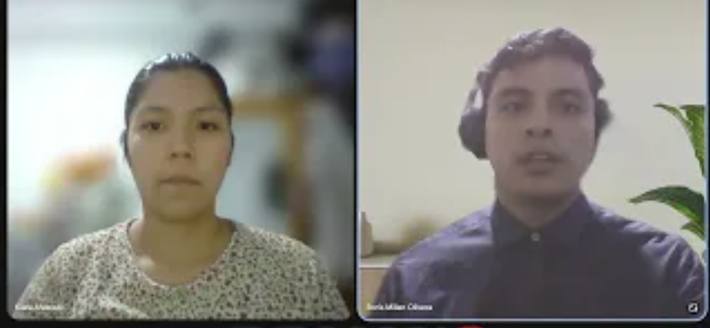

**Resumen de la entrevista:** Kiara representante de ETUCHISA SAC.
La entrevistada señala que actualmente la empresa cuenta con medidas básicas de seguridad, como cámaras en algunas unidades, supervisión en paraderos y contacto con autoridades; sin embargo, reconoce que la cobertura es limitada y no existe un sistema integral.
El principal problema identificado es la extorsión por parte de organizaciones criminales, además de robos tanto dentro como fuera de las unidades, especialmente en zonas con poca iluminación. Estas situaciones ocurren con alta frecuencia, afectando tanto a conductores como a pasajeros.
El impacto es significativo, no solo en términos económicos, sino también en la seguridad de las personas y la reputación de la empresa. Actualmente, la comunicación ante emergencias se realiza mediante llamadas telefónicas, lo que genera demoras en la respuesta.
Asimismo, destaca la dificultad para monitorear en tiempo real las unidades debido a la falta de tecnología integrada, y menciona que la verificación de conductores se realiza de forma manual, lo que implica riesgos de suplantación.
Finalmente, considera que una solución digital permitiría mejorar el control de conductores y unidades, aunque identifica como barreras principales el costo de implementación y la capacitación del personal.

**Entrevistado 2: Jaime A. Russvelt**
Edad: 50
Distrito: Ancon

**Resumen de la entrevista:** Representante de la empresa nueva estrella

El entrevistado describe un contexto altamente crítico, donde la extorsión es el principal problema estructural, afectando tanto a la empresa como a los propietarios de unidades. Señala que existen cobros elevados por parte de organizaciones criminales, incluso múltiples grupos simultáneamente.
Además, menciona la presencia de delincuencia común (robos a pasajeros), pero enfatiza que la mayor amenaza proviene de la delincuencia organizada. Estas situaciones generan un fuerte impacto, provocando escasez de conductores, ya que muchos abandonan el trabajo o migran al extranjero por temor.
La empresa no cuenta con mecanismos efectivos de prevención, ya que generalmente se enteran de los incidentes después de que ocurren, evidenciando una falta de capacidad de respuesta en tiempo real.
En cuanto a la supervisión, reconoce que no existen herramientas tecnológicas adecuadas y que dependen en gran medida de procesos manuales. La verificación de conductores se basa en documentación, aunque admite que no garantiza un control total.
El entrevistado considera que una solución tecnológica sería útil, especialmente si permite comunicación directa con autoridades, pero señala que su efectividad dependería también del apoyo institucional. Su principal preocupación es la falta de respuesta del Estado frente a la inseguridad.

**Entrevistado 3: Puma Nicanor Yamoca**
Edad: 45
Distrito: Santa Anita

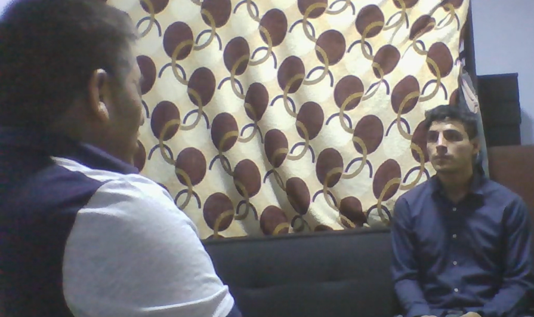

**Resumen de la entrevista:** Representante de Alamo santa rosa la G, propietario de 12 unidades que trabaja desde pacasmayo hasta santa anita
El entrevistado manifiesta que tanto conductores como pasajeros trabajan en un entorno de alta inseguridad, donde la extorsión es el problema más grave y constante. Indica que el pago de cupos es prácticamente obligatorio para poder operar con normalidad.
Destaca que las organizaciones criminales ejercen un control constante, llegando incluso a conocer información personal de los transportistas, lo que incrementa el nivel de riesgo. Esta situación tiene un impacto directo en la economía, ya que obliga a los conductores a trabajar más y aumentar las tarifas, afectando también a los usuarios.
En caso de emergencias, señala que la respuesta de las autoridades es lenta e ineficiente, lo que genera desconfianza en el sistema de seguridad. Además, considera que es muy difícil supervisar las unidades, especialmente en rutas largas.
La verificación de conductores se basa en requisitos básicos como licencias y formación, pero reconoce la existencia de personas infiltradas o no autorizadas.
Finalmente, valora positivamente la implementación de tecnología, indicando que herramientas como sensores, cámaras o sistemas de monitoreo serían de gran ayuda. Sin embargo, resalta la necesidad de capacitación tanto para conductores como para usuarios, para asegurar su correcta adopción.

#### 2.2.3 Análisis de entrevista

<h3>Conductores (operarios) de transporte público:</h3>

**Entrevista 1:** El segmento objetivo del entrevistado es:
Conductor de transporte público urbano que opera largas jornadas en rutas con alta incidencia de inseguridad y extorsión, especialmente en horarios nocturnos.
Los aspectos mas comunes que señala el entrevistado son los siguientes:
- Jornada extensa (4 a.m. a 10 p.m.) con mayor inseguridad en la noche, especialmente en zonas peligrosas.
- Extorsiones y cobros ilegales son frecuentes, con amenazas físicas.
- Baja seguridad en la unidad (solo una cámara de mala calidad).
- Respuesta ante emergencias lenta y poco efectiva (depende del celular personal).
- Necesita soluciones como monitoreo en tiempo real, botón de pánico y conteo de pasajeros.
- Alta disposición a usar una app de seguridad (incluyendo QR), sobre todo en horarios nocturnos.

**Entrevista 2:** El segmento objetivo del entrevistado es:
Conductor de transporte público urbano que trabaja en rutas con zonas de alto riesgo, expuesto a extorsiones recurrentes y con limitada infraestructura de seguridad durante jornadas prolongadas.
Los aspectos más comunes que señala el entrevistado son los siguientes:
- Jornada larga (4:30 a.m. a 9 p.m.) con mayor riesgo en zonas peligrosas durante la noche.
- Cobros de cupo frecuentes (2 veces por semana), normalizados como parte del trabajo.
- Seguridad deficiente (cámara en mal estado y sin apoyo de la empresa).
- Emergencias difíciles de gestionar (llamadas peligrosas mientras conduce).
- Necesita un botón de alerta rápida sin comunicación verbal.
- Percibe baja respuesta policial como un problema grave.
- Alta disposición a usar una app con monitoreo y validación QR, especialmente en zonas y horarios de riesgo.

**Entrevista 3:** El segmento objetivo del entrevistado es:
Conductora de transporte público urbano, jefa de familia, que opera en entornos de alta inseguridad, con mayor exposición a acoso y extorsión, y con necesidad de soluciones de seguridad discretas durante toda su jornada.
Los aspectos más comunes que señala la entrevistada son los siguientes:
- Jornada extensa (6 a.m. a 8 p.m.) combinada con responsabilidades familiares.
- Riesgo constante durante todo el día, con mayor vulnerabilidad por ser mujer (acoso e intimidación).
- Extorsión semanal, con mayor presión hacia ella.
- Nula seguridad en la unidad (solo un contacto telefónico poco efectivo).
- Necesita una alarma silenciosa que no alerte al agresor.
- Muy alta disposición a usar una app de seguridad desde el primer día.
- Valora la validación por QR para agilizar la respuesta ante incidentes.

<h3>Representantes de Empresas o consorcios de transporte público:</h3>

**Entrevista 1:** El segmento objetivo del entrevistado es:
Representante de empresa de transporte público con múltiples unidades en operación urbana. 
Los aspectos mas comunes que señala e entrevistado son los siguientes:
- Falta de un sistema tecnológico integral que permita monitoreo en tiempo real de las unidades.
- Alta frecuencia de problemas de seguridad como extorsión y robos en rutas.
- Limitaciones en la respuesta ante emergencias debido al uso de medios tradicionales como llamadas telefónicas.

**Entrevista 2:** El segmento objetivo del entrevistado es:
Representante de empresa de transporte público afectada por delincuencia organizada y extorsión. 
Los aspectos mas comunes que señala el entrevistado son los siguientes:
- La extorsión es el problema principal y afecta directamente la operación del servicio.
- Falta de herramientas para prevenir incidentes, ya que la empresa se entera después de que ocurren.
- Impacto crítico en la operación, incluyendo escasez de conductores y reducción de unidades activas.

**Entrevista 3:** El segmento objetivo del entrevistado es Propietario de unidades de transporte público que opera en rutas extensas. 

Los aspectos más comunes que señala el entrevistado son los siguientes:
- La extorsión es constante y condiciona el funcionamiento del servicio.
- Dificultad para supervisar unidades y garantizar seguridad en rutas largas.
- Necesidad de implementar soluciones tecnológicas, aunque con énfasis en capacitación para su uso.

### 2.3 Needfinding

En esta sección se presentarán los artefactos resultantes del proceso de análisis de la información recolectada de los segmentos objetivos. Aquí se incluyen secciones para User Personas, User Task Matrix, User Journey Maps, Empathy Mapping y As-is Scenario Mapping.

#### 2.3.1. User Personas

A continuación, se presentan los User Personas diseñados para representar a los segmentos objetivo identificados durante la fase de investigación: conductores (operarios) de transporte público y empresas o consorcios de transporte público. Estos arquetipos detallan variables demográficas, rasgos psicográficos, motivaciones y comportamientos, así como los pains (frustraciones) y gains (objetivos) que enfrentan frente a la inseguridad y extorsión en su operación diaria. Asimismo, se analiza su nivel de adopción tecnológica y su disposición a interactuar con soluciones digitales de monitoreo y seguridad. Toda la información ha sido sintetizada a partir de los insights recolectados en las entrevistas (2.2.3) y estructurada mediante la plataforma UXPressia para garantizar una representación fiel de las necesidades y el contexto real de cada segmento de usuario.

**Segmento Objetivo 1: Conductores (operarios) de transporte público**

[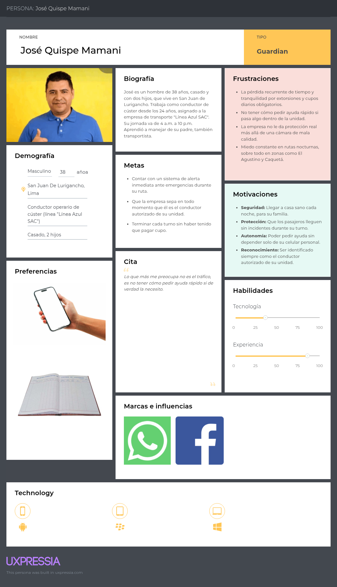](./assets/img/Segmento1-UserPersona.png)

**Segmento Objetivo 2: Empresas o consorcios de transporte público**

[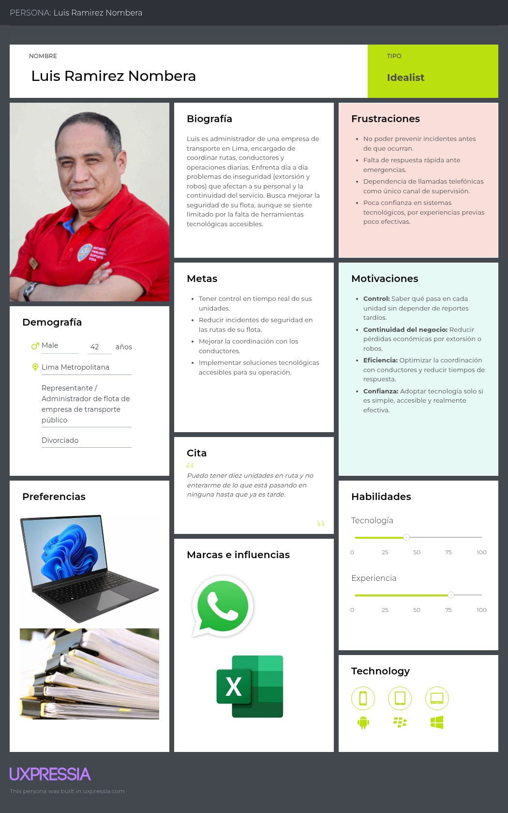](./assets/img/Segmento2-UserPersona.png)

---

#### 2.3.2 User Task Matrix

Esta es una lista de actividades que nuestros usuarios completan, independientemente de que exista o no una solución de software como SafeBus. Esto nos ayudará a entender la importancia de las tareas que podríamos apoyar dentro de nuestro producto. Se consideran los dos segmentos objetivo: José Quispe Mamani (Conductor) y Luis Ramirez Nombera (Empresa/Consorcio).

| Actividades | Conductor — Frecuencia | Conductor — Importancia | Empresa — Frecuencia | Empresa — Importancia |
|---|---|---|---|---|
| Iniciar jornada y verificar el estado de la unidad antes de salir | Con frecuencia | Alta | — | — |
| Revisar el estado operativo de todas las unidades de la flota | — | — | Con frecuencia | Alta |
| Confirmar la ruta asignada y horario de salida con la empresa | Con frecuencia | Alta | — | — |
| Supervisar las unidades de transporte en ruta | — | — | Con frecuencia | Alta |
| Cobrar pasaje y controlar el flujo de subida y bajada de pasajeros | Con frecuencia | Alta | — | — |
| Coordinar con conductores durante la jornada | — | — | Con frecuencia | Alta |
| Comunicarse con otros conductores vía celular ante situaciones de riesgo | A veces | Alta | — | — |
| Reportar incidentes o percances al encargado de la empresa | A veces | Alta | — | — |
| Atender incidentes o reportes de seguridad reportados por los conductores | — | — | Con frecuencia | Alta |
| Evaluar zonas de riesgo durante la ruta y tomar desvíos si es necesario | Con frecuencia | Alta | — | — |
| Pagar cuota o cupo a personas externas que operan en la ruta | Con frecuencia | Media | — | — |
| Gestionar problemas de extorsión o amenazas a nivel de flota | — | — | Con frecuencia | Alta |
| Comunicarse con autoridades (policía, emergencia) | — | — | A veces | Alta |
| Verificar documentación e identidad del conductor asignado a la unidad | — | — | A veces | Media |
| Recibir reportes o quejas de pasajeros | — | — | A veces | Media |
| Resolver incidentes operativos con información incompleta o tardía | — | — | Con frecuencia | Alta |
| Registrar el cierre de turno y entregar la unidad al siguiente conductor | Con frecuencia | Alta | — | — |
| Evaluar la implementación de nuevas tecnologías de seguridad | — | — | A veces | Media |

Las tareas de mayor frecuencia e importancia para el Conductor son las relacionadas con el inicio y cierre de su jornada, el control del flujo de pasajeros y la evaluación constante de zonas de riesgo durante la ruta — actividades que realiza de forma individual y sin apoyo tecnológico. Para la Empresa, las tareas más frecuentes e importantes están concentradas en la supervisión de la flota y la gestión de problemas de extorsión, actividades que hoy dependen de reportes verbales y llamadas telefónicas antes que de información centralizada en tiempo real.

La principal coincidencia entre ambos segmentos es la exposición constante a situaciones de extorsión y amenazas: el Conductor la enfrenta directamente en ruta (pagando cupo), mientras que la Empresa la gestiona de forma indirecta y reactiva, una vez que el conductor reporta el incidente. La principal diferencia es el nivel de visibilidad: el Conductor actúa con la información que percibe él mismo durante su turno, mientras que la Empresa depende por completo de que sus conductores le reporten manualmente lo que ocurre en cada unidad, sin ningún medio propio de verificación en tiempo real.

---

#### 2.3.3 User Journey Mapping

En esta sección se presentan los User Journey Maps elaborados para cada User Persona, con el objetivo de representar el recorrido end-to-end que atraviesa cada segmento frente a la inseguridad y la extorsión en su operación diaria, desde que percibe el riesgo hasta que cierra su jornada u operación. Se elaboran las versiones **As-Is** de los Journey Maps, es decir, la situación actual de cada segmento sin que exista SafeBus, identificando en cada etapa las acciones que realiza, sus pensamientos, y su estado emocional. Cada Journey Map se encuentra vinculado a su User Persona correspondiente (2.3.1), y ambos fueron elaborados en la plataforma UXPressia, a partir de los hallazgos del análisis de entrevistas (2.2.3).

**Segmento Objetivo 1: Conductores (operarios) de transporte público**

[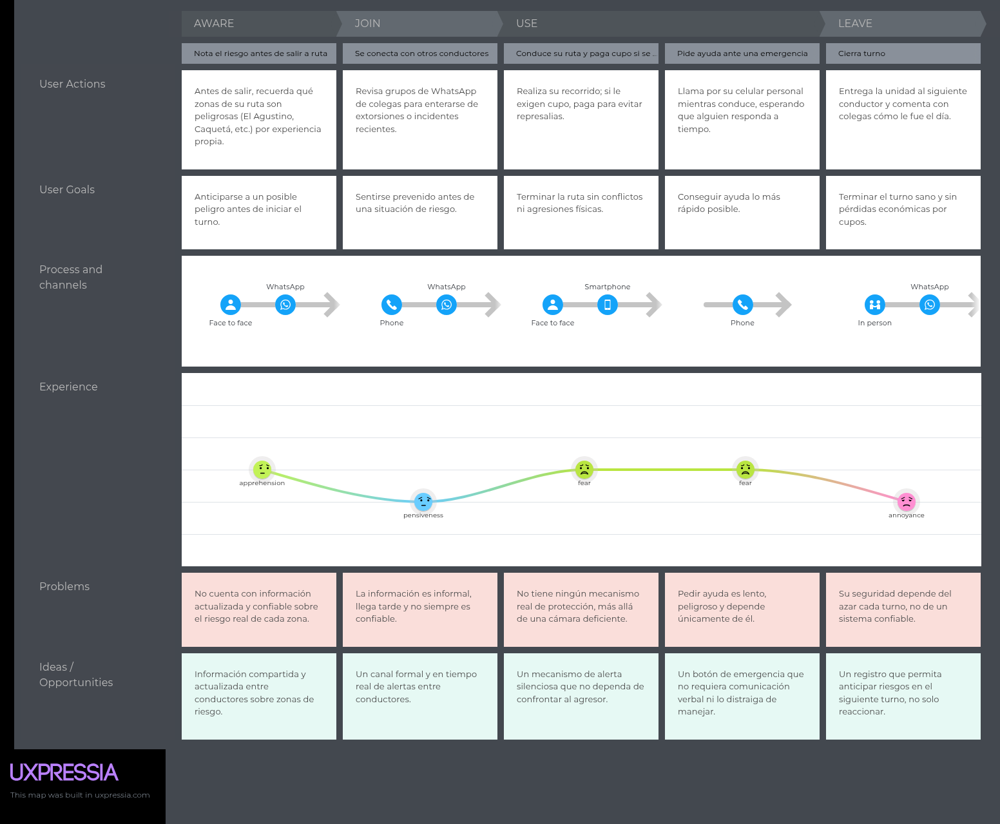](./assets/img/Segmento1-JourneyMapping.png)

**Segmento Objetivo 2: Empresas o consorcios de transporte público**

[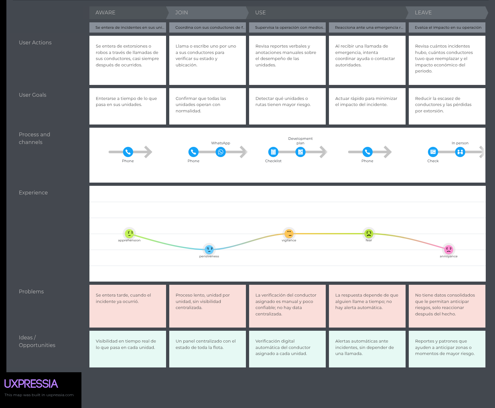](./assets/img/Segmento2-JourneyMapping.png)

---

#### 2.3.4 Empathy Mapping

En esta sección se presentan los Empathy Maps elaborados para cada User Persona, con el objetivo de ponerse en el lugar de cada segmento y profundizar en sus necesidades, comportamientos y estado emocional frente a la inseguridad y la extorsión en su operación diaria. El proceso consistió en colocar al centro a cada User Persona (2.3.1) y responder, a partir de los hallazgos del análisis de entrevistas (2.2.3), las preguntas ¿Con quién estamos empatizando?, ¿Qué necesita hacer?, ¿Qué está viendo?, ¿Qué está diciendo?, ¿Qué está haciendo?, ¿Qué está escuchando? y ¿Cómo se siente y qué piensa?, identificando además sus Esfuerzos (pains) y Ganancias (gains). Ambos Empathy Maps fueron elaborados en la plataforma UXPressia.

**Segmento Objetivo 1: Conductores (operarios) de transporte público**

[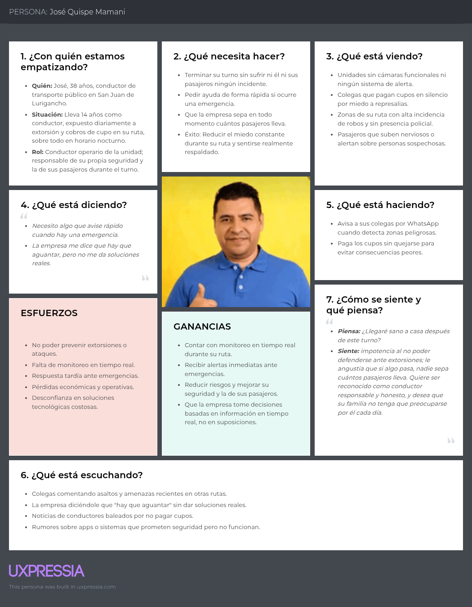](./assets/img/Segmento1-EmpathyMapping.png)

**Segmento Objetivo 2: Empresas o consorcios de transporte público**

[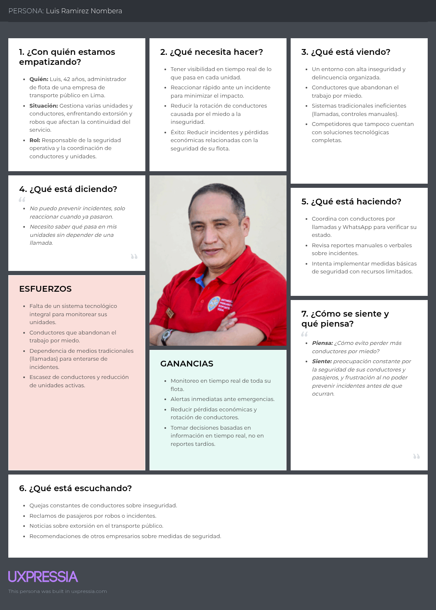](./assets/img/Segmento2-EmpathyMapping.png)

---

#### 2.3.5. As-is Scenario Mapping.

En esta sección se presentan los As-Is Scenario Mapping elaborados para cada User Persona, con el objetivo de representar cómo cada segmento enfrenta hoy la inseguridad y la extorsión en su operación diaria, sin que exista SafeBus. El proceso de elaboración pasó por las etapas de preparación, revisando los hallazgos del análisis de entrevistas (2.2.3) y los User Persona correspondientes (2.3.1); una lluvia de ideas individual donde cada integrante del equipo identificó por separado los pasos que sigue cada segmento; una revisión en conjunto para consolidar e identificar las fases como columnas y nombrarlas; y finalmente el etiquetado de las áreas positivas, negativas y blank areas (áreas donde el equipo reconoce que necesita aprender más antes de diseñar la solución). Cada Scenario Map incluye las filas Phases, Doing, Thinking y Feeling, y se encuentra vinculado a su User Persona correspondiente. Ambos fueron elaborados en la plataforma Miro.

**Segmento Objetivo 1: Conductores (operarios) de transporte público**

[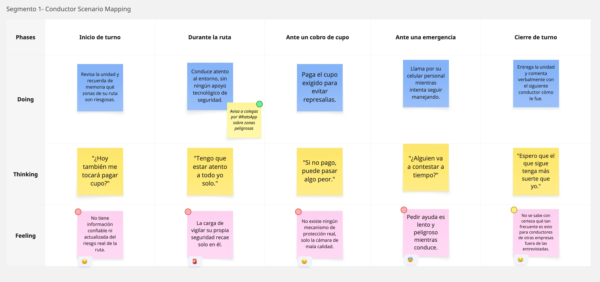](./assets/img/Segmento1-As-IsMapping.png)

**Segmento Objetivo 2: Empresas o consorcios de transporte público**

[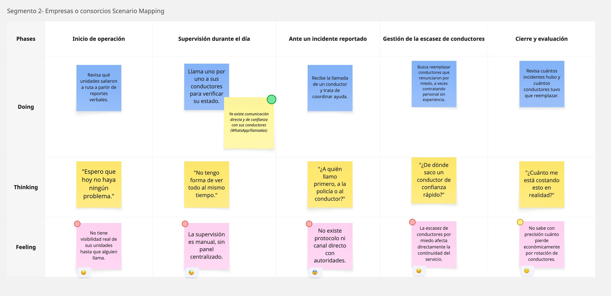](./assets/img/Segmento2-As-IsMapping.png)

---

### 2.4 Ubiquitous Language

**Authorized Driver (Conductor Autorizado):** Conductor validado formalmente como el operario asignado a una unidad específica, mediante un proceso de validación de identidad. La empresa puede confirmar en todo momento que es él quien está operando la unidad.

**Consortium / Transport Company (Empresa o Consorcio de Transporte):** Organización responsable de la gestión de una flota de unidades de transporte público, incluyendo la asignación de conductores, rutas y la supervisión de la operación.

**Critical Alert (Alerta Crítica):** Notificación de alta prioridad generada ante una situación de riesgo que requiere atención inmediata, ya sea activada manualmente por el conductor o detectada automáticamente por el sistema.

**Extortion Fee (Cupo):** Cobro ilegal exigido por terceros a los conductores para permitirles operar en determinada ruta. Constituye la principal amenaza de seguridad que enfrentan los conductores en su operación diaria.

**Fleet (Flota):** Conjunto de unidades de transporte gestionadas por una misma empresa o consorcio.

**Footage (Grabación):** Registro de video capturado por la cámara de vigilancia de una unidad durante un viaje, utilizado como evidencia ante un incidente o evento de seguridad.

**Identity Validation (Validación de Identidad):** Proceso mediante el cual un conductor confirma su identidad antes de iniciar su jornada (por ejemplo, mediante código QR), permitiendo verificarlo como el Authorized Driver de la unidad.

**Incident (Incidente):** Evento inesperado que afecta el desarrollo normal de un viaje, pudiendo requerir intervención o seguimiento por parte de la empresa.

**Onboard Surveillance Camera (Cámara de Vigilancia a Bordo):** Dispositivo instalado dentro de la unidad que registra en video de forma continua el interior del vehículo, sirviendo tanto de disuasivo ante incidentes como de evidencia (Footage) para su posterior revisión.

**Operational Control (Control Operativo):** Supervisión general de las unidades, viajes y eventos de una flota, con el fin de asegurar el correcto funcionamiento del servicio.

**Panic Alert (Alerta de Pánico):** Señal de emergencia activada manualmente por el conductor ante una situación de peligro inminente, considerada un tipo de Critical Alert.

**Passenger Count (Conteo de Pasajeros):** Registro del número de pasajeros a bordo de una unidad en un momento determinado, permitiendo a la empresa conocer la ocupación real del vehículo durante el viaje.

**Real-Time Monitoring (Monitoreo en Tiempo Real):** Seguimiento continuo de la ubicación, estado y video de las unidades, permitiendo observar su comportamiento durante la operación sin depender de reportes posteriores.

**Route (Ruta):** Trayecto definido que sigue una unidad de transporte, incluyendo punto de inicio, paradas y destino final.

**Security Event (Evento de Seguridad):** Situación relevante ocurrida durante un viaje que puede afectar la seguridad de los ocupantes de la unidad, como un Incident o una Panic Alert.

**Service Interruption (Interrupción del Servicio):** Situación en la que una unidad deja de operar de manera parcial o total durante un viaje.

**Tracking (Seguimiento):** Proceso de observar y registrar la ubicación y el comportamiento de una unidad a lo largo del tiempo.

**Transport Unit (Unidad de Transporte):** Vehículo que forma parte de la Flota y es objeto de monitoreo, seguimiento de ubicación, estado y eventos.

**Trip (Viaje):** Recorrido específico realizado por una unidad de transporte dentro de una Ruta en un periodo determinado.
