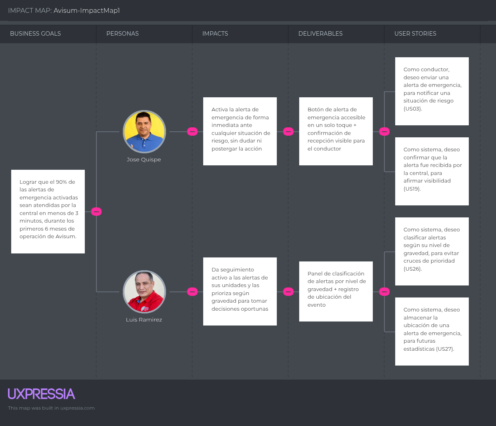
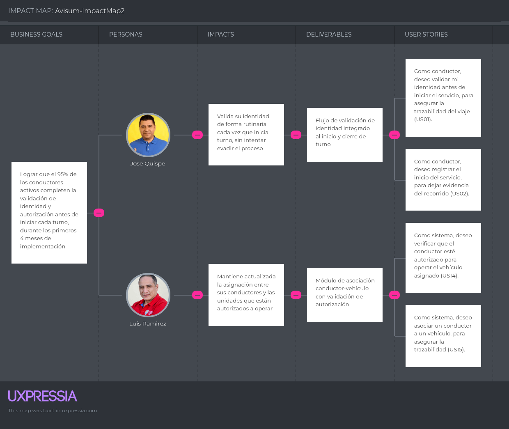
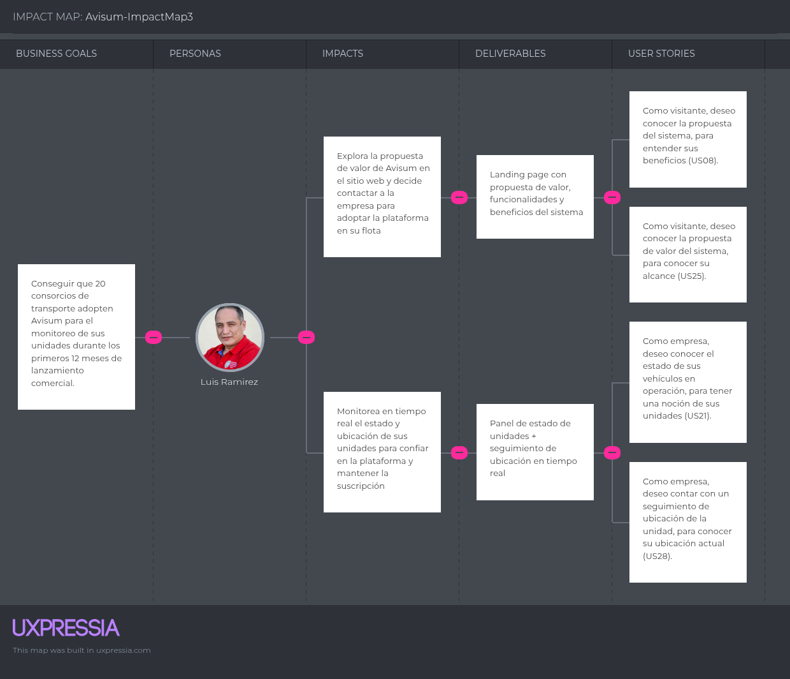

# Capítulo III: Requirements Specification

## 3.1. To-Be Scenario Mapping

<h3>Segento 1</h3>

|Inicio de turno|Durante la ruta|Ante un cobro de cupo|Ante una emergencia|Cierre de turno|
| :--: | :--: | :--: | :--: | :--: |
| **Doing** | Inicia sesión y valida su identidad mediante reconocimiento facial antes de recibir la unidad | Conduce sabiendo que tiene el botón de alerta accesible en todo momento, sin distraerse con el celular | Activa la alerta de pánico de forma discreta si percibe una amenaza durante el cobro | Presiona el botón de pánico y recibe confirmación de que la alerta llegó a la central | Finaliza el servicio desde la misma app; el cierre queda registrado automáticamente |
| **Thinking** | "Ya no tengo que recordar de memoria qué zonas son riesgosas, el sistema me respalda todo el turno." | "Si algo pasa, no dependo de avisar por WhatsApp a un colega, la central ya lo sabe." | "Ahora queda un registro de lo que pasó, no es mi palabra sola contra la de nadie." | "Ya no me pregunto si alguien va a contestar, sé que la alerta se envió y fue confirmada." | "Ya no tengo que contarle todo de memoria al siguiente conductor, mi turno ya quedó registrado." |
| **Feeling** | Confianza, sensación de respaldo desde el inicio 🙂 | Tranquilidad, menor carga mental de vigilar su propia seguridad 🙂 | Menos indefensión, respaldo institucional 😌 | Alivio inmediato al ver la confirmación 😮‍💨→🙂 | Sensación de continuidad y respaldo documentado 🙂 |

<h3>Segento 2</h3>

|Inicio de operación | Supervisión durante el día | Ante un incidente reportado | Gestión de la escasez de conductores | Cierre y evaluación |
| :--: | :--: | :--: | :--: | :--: |
| **Doing** | Abre el panel de Avisum y ve qué unidades están validadas e iniciando servicio, sin depender de reportes verbales | Consulta el panel centralizado de estado y ubicación en tiempo real, en vez de llamar uno por uno | Recibe la alerta ya clasificada por gravedad, con ubicación exacta del evento, directo en el panel | Consulta el historial de emergencias para identificar patrones de riesgo y sustentar mejoras a sus conductores | Revisa el historial de alertas y métricas del periodo directamente en el sistema |
| **Thinking** | "Ya no tengo que esperar llamadas para saber quién salió a ruta." | "Puedo ver todo al mismo tiempo, ya no tengo que llamar a cada conductor." | "Ya no tengo que decidir a quién llamar primero, el sistema me dice qué tan grave es y dónde está." | "Ahora tengo datos concretos de cuántos incidentes hubo y dónde, no solo percepción." | "Ya puedo cuantificar cuánto he mejorado en seguridad, con datos reales." |
| **Feeling** | Mayor control desde el primer momento del día 🙂 | Tranquilidad y eficiencia, menos tiempo invertido en supervisión manual 🙂 | Rapidez y certeza en la toma de decisiones 😌 | Confianza en decisiones basadas en evidencia, no en intuición 🙂 | Seguridad en la gestión y argumento sólido frente a la operación de la flota 🙂 |

## 3.2. User Stories

<h3>Epics</h3>

Las Epics representan agrupaciones de alto nivel que permiten organizar las principales funcionalidades de Avisum. Cada épica está conformada por un conjunto de historias de usuario relacionadas, facilitando la estructuración del sistema en diferentes bloques funcionales. Esta organización permite establecer una planificación del desarrollo más clara y ordenada. Asimismo, dentro de la metodología ágil, las épicas se descomponen en historias de usuario específicas, lo que permite definir con mayor precisión las tareas y requerimientos que serán desarrollados por el equipo.

| Epic ID | Title | Description | Acceptance Critera | Related to (Epic ID) |
| :--: | :--: | :--: | :--: | :--: |
|EP001 |Validación de identidad de conductor| Como sistema, quiero validar la indentidad del conductor, para garantizar que solo una persona calificada y autorizada inicie el servicio y asegurar la trazabilidad de cada viaje.| No aplicable|No aplicable|
|EP002|Gestión de alertas de pánico|Como sistema, quiero gestionar la activación, envio, recepción y seguimiento de alertas de pánico generadas por el conductor, para permitir que la central active su protocolo de ayuda ante una situación de riesgo|No aplicacable|No aplicable|
|EP003|Seguimiento de unidades|Como sistema, quiero hacer seguimiento al estado, ubicación y conteo de pasajeros del trasporte|No aplicable| No aplicable|
|EP004|Landing Page|Como visitante, quiero acceder a información clara sobre Avisum, sus funcionalidades, beneficios y al equipo detras de su creación, para comprender su propuesta de valor y evaluar su utilidad|No aplicable|No aplicable|
|EP005|API RESTful del sistema| Como developer, quiero disponer de endpoints que permitan interactuar con las funcionalidades de validación facila y gestión de alertas de pánico, para integrar servicios y asegurar el flijo correcto de información entre componentes|No aplicable| No Aplicable|

_Tabla 1. Epics del proyecto - Elaboración propia._

Las historias de Usuario describen de manera detalladas las funciones del sistema desde la perspectiva e lso distintos actores de Avissum. Cada historia especifica el objetivo del usuario y sus criteriosde aceptación

|Story ID|Title|User|Description|Acceptance Criteria|Epic ID|Priority|
| :--: | :--: | :--: | :--: | :--: | :--: | :--:|
|US01|Verificar identidad de conductor|Conductor|Como conductor, quiero validar mi identidad antes de iniciar el servicio, para asegurar la trazabilidad del viaje.|**Escenario (Éxito):**  **Given** que el conductor inicia su jornada,  **When** proporciona su código de verificación,  **Then** el sistema valida su identidad correctamente.  **Escenario (Fracaso):**  **Given** que el conductor inicia su jornada,  **When** proporciona un código de verificación inválido,  **Then** el sistema rechaza la validación.|EP01|Alta|
|US02|Registrar inicio de servicio|Conductor|Como conductor, quiero registrar el inicio del servicio, para dejar evidencia del recorrido.|**Escenario (Éxito):**  **Given** que el conductor ha sido validado,  **When** inicia el viaje,  **Then** el sistema registra la hora y el estado de inicio.  **Escenario (Fracaso):**  **Given** que el conductor no ha sido validado,  **When** intenta iniciar el servicio,  **Then** el sistema impide el registro del inicio.|EP01|Alta|
|US03|Activar alerta de emergencia|Conductor|Como conductor, quiero enviar una alerta de emergencia, para notificar una situación de riesgo.|**Escenario (Éxito):**  **Given** que el conductor se encuentra en servicio,  **When** activa una alerta de emergencia,  **Then** el sistema envía la alerta a la central.  **Escenario (Fracaso):**  **Given** que no existe un servicio activo,  **When** el conductor intenta activar una alerta,  **Then** el sistema rechaza la solicitud.|EP02|Alta|
|US04|Recepción de alerta|Sistema|Como sistema, quiero notificar a la central de operaciones, para gestionar la emergencia.|**Escenario (Éxito):**  **Given** que una alerta ha sido enviada,  **When** el sistema la procesa,  **Then** la central recibe la notificación.  **Escenario (Fracaso):**  **Given** que la alerta contiene datos incompletos,  **When** el sistema intenta procesarla,  **Then** la alerta es rechazada.|EP02|Alta|
|US05|Registro de evento de emergencia|Sistema|Como sistema, quiero almacenar las alertas generadas, para su seguimiento.|**Escenario (Éxito):**  **Given** que una alerta es válida,  **When** es recibida por el sistema,  **Then** se almacena el evento.  **Escenario (Fracaso):**  **Given** que la alerta no cumple con el formato requerido,  **When** se intenta registrar,  **Then** el sistema no almacena el evento.|EP02|Media|
|US06|Conteo de pasajeros|Sistema|Como sistema, quiero contabilizar los pasajeros a bordo, para estimar el riesgo en caso de emergencia.|**Escenario (Éxito):**  **Given** que el vehículo está en operación,  **When** se detecta el ingreso de pasajeros,  **Then** el sistema incrementa el conteo.  **Escenario (Fracaso):**  **Given** que no hay datos de sensores disponibles,  **When** se intenta actualizar el conteo,  **Then** el sistema mantiene el último valor registrado.|EP03|Alta|
|US07|Consultar número de pasajeros|Sistema|Como sistema, quiero disponer del número de pasajeros, para reportes de emergencia.|**Escenario (Éxito):**  **Given** que existe un viaje en curso,  **When** se consulta el estado del vehículo,  **Then** el sistema retorna la cantidad de pasajeros.  **Escenario (Fracaso):**  **Given** que no existe un viaje activo,  **When** se realiza la consulta,  **Then** el sistema indica que no hay información disponible.|EP03|Media|
|US08|Visualizar información del servicio|Visitante|Como visitante, quiero conocer la propuesta del sistema, para entender sus beneficios.|**Escenario (Éxito):**  **Given** que el visitante accede al sitio web,  **When** carga el contenido,  **Then** el sistema muestra la información del servicio.  **Escenario (Fracaso):**  **Given** que el contenido no está disponible,  **When** el visitante accede al sitio,  **Then** el sistema muestra un mensaje de indisponibilidad.|EP04|Media|
|US09|Visualización de funcionalidades del servicio|Visitante|Como visitante, quiero conocer las funcionalidades principales del sistema, para evaluar su utilidad.|**Escenario (Éxito):**  **Given** que el visitante navega por el sitio,  **When** accede a la sección de funcionalidades,  **Then** el sistema presenta las funcionalidades.  **Escenario (Fracaso):**  **Given** que no existen funcionalidades registradas,  **When** se accede a la sección,  **Then** el sistema indica ausencia de contenido.|EP04|Media|
|US10|Endpoint de validación de conductor|Developer|Como developer, quiero validar la identidad del conductor mediante un servicio API, para poder consultarlo en cualquier momento.|**Escenario (Éxito):**  **Given** credenciales válidas,  **When** se envía la solicitud de validación,  **Then** el API retorna la confirmación de identidad.  **Escenario (Fracaso):**  **Given** una solicitud con identificador inválido,  **When** el API procesa la solicitud,  **Then** retorna un error de validación.|EP05|Alta|
|US11|Endpoint de inicio de servicio|Developer|Como developer, quiero registrar el inicio de un servicio mediante API, para poder hacer pruebas del servicio.|**Escenario (Éxito):**  **Given** una solicitud válida,  **When** se envían los datos del servicio,  **Then** el API registra el inicio correctamente.  **Escenario (Fracaso):**  **Given** una solicitud inválida,  **When** el API procesa la solicitud,  **Then** retorna un error.|EP05|Alta|
|US12|Endpoint de alerta de emergencia|Developer|Como developer, quiero enviar alertas de emergencia mediante API, para realizar un testeo.|**Escenario (Éxito):**  **Given** una solicitud con datos completos,  **When** el API recibe la alerta,  **Then** registra la alerta correctamente.  **Escenario (Fracaso):**  **Given** una solicitud con datos incompletos,  **When** el API procesa la alerta,  **Then** retorna un error.|EP05|Alta|
|US13|Endpoint de conteo de pasajeros|Developer|Como developer, quiero actualizar el número de pasajeros mediante API, para poder realizar pruebas que involucren el número de pasajeros.|**Escenario (Éxito):**  **Given** una solicitud de actualización,  **When** se envía el nuevo conteo,  **Then** el API actualiza el valor correctamente.  **Escenario (Fracaso):**  **Given** una solicitud de actualización,  **When** ocurre un error interno,  **Then** se envía un mensaje de error y se mantiene el último número de conteo.|EP05|Media|
|US14|Validar la autorización del conductor|Sistema|Como sistema, quiero verificar que el conductor esté autorizado para operar el vehículo asignado.|**Escenario (Éxito):**  **Given** que el conductor está registrado,  **When** el sistema valida su autorización,  **Then** se confirma que puede operar el vehículo.  **Escenario (Fracaso):**  **Given** que el conductor no está autorizado,  **When** el sistema valida su información,  **Then** se rechaza la operación del vehículo.|EP01|Alta|
|US15|Asociación de conductor al vehículo|Sistema|Como sistema, quiero asociar un conductor a un vehículo, para asegurar la trazabilidad.|**Escenario (Éxito):**  **Given** un conductor válido,  **When** se realiza la asignación,  **Then** el sistema registra la relación conductor-vehículo.  **Escenario (Fracaso):**  **Given** datos inconsistentes,  **When** se intenta asociar,  **Then** el sistema rechaza la asignación.|EP01|Media|
|US16|Consultar historial de emergencia|Empresa|Como empresa, quiero revisar el historial de alertas, para análisis de seguridad.|**Escenario (Éxito):**  **Given** registros almacenados,  **When** se consulta el historial,  **Then** el sistema devuelve la lista de eventos.  **Escenario (Fracaso):**  **Given** que no existen registros,  **When** se realiza la consulta,  **Then** el sistema indica ausencia de datos.|EP02|Media|
|US17|Navegar entre secciones|Visitante|Como visitante, quiero desplazarme entre secciones, para explorar el contenido.|**Escenario (Éxito):**  **Given** que el visitante accede al sitio,  **When** navega entre secciones,  **Then** el sistema carga el contenido correspondiente.  **Escenario (Fracaso):**  **Given** un error en la navegación,  **When** se intenta acceder a una sección,  **Then** el sistema indica error de acceso.|EP04|Media|
|US18|Endpoint de autentificación|Developer|Como developer, quiero autenticar solicitudes al sistema, para evitar accesos no autorizados.|**Escenario (Éxito):**  **Given** credenciales válidas,  **When** se envía la solicitud,  **Then** el API autoriza el acceso.  **Escenario (Fracaso):**  **Given** credenciales inválidas,  **When** se envía la solicitud,  **Then** el API rechaza el acceso.|EP05|Alta|
|US19|Confirmación de recepción de alerta|Sistema|Como sistema, quiero confirmar que la alerta fue recibida por la central, para afirmar visibilidad.|**Escenario (Éxito):**  **Given** una alerta enviada,  **When** la central la recibe,  **Then** el sistema registra la confirmación.  **Escenario (Fracaso):**  **Given** una alerta enviada,  **When** no se recibe confirmación,  **Then** el sistema marca la alerta como no confirmada.|EP02|Media|
|US20|Registro de turno terminado|Conductor|Como conductor, quiero finalizar el servicio, para cerrar el registro del viaje.|**Escenario (Éxito):**  **Given** un servicio en curso,  **When** el conductor finaliza el servicio,  **Then** el sistema registra el cierre.  **Escenario (Fracaso):**  **Given** que no existe un servicio activo,  **When** se intenta finalizar,  **Then** el sistema rechaza la operación.|EP01|Media|
|US21|Visualizar estado de unidades|Empresa|Como empresa, quiero conocer el estado de sus vehículos en operación, para tener una noción de sus unidades.|**Escenario (Éxito):**  **Given** vehículos registrados,  **When** se consulta su estado,  **Then** el sistema muestra su información actual.  **Escenario (Fracaso):**  **Given** que no hay vehículos registrados,  **When** se realiza la consulta,  **Then** el sistema indica ausencia de datos.|EP03|Media|
|US22|Visualización de segmento de clientes|Visitante|Como visitante, quiero identificar a qué tipo de usuarios está dirigido el sistema, para su conocimiento.|**Escenario (Éxito):**  **Given** contenido disponible,  **When** el visitante accede a la sección,  **Then** el sistema muestra los segmentos definidos.  **Escenario (Fracaso):**  **Given** que no existe contenido,  **When** se accede a la sección,  **Then** el sistema muestra un mensaje informativo.|EP04|Baja|
|US23|Visualización de misión y visión|Visitante|Como visitante, quiero conocer la misión y visión de la startup, para tener una idea clara de los objetivos.|**Escenario (Éxito):**  **Given** que el contenido está disponible,  **When** el visitante accede a la sección,  **Then** el sistema muestra la misión y visión.  **Escenario (Fracaso):**  **Given** que el contenido no está disponible,  **When** se accede,  **Then** el sistema muestra un mensaje de error.|EP04|Baja|
|US24|Endpoint de finalización de servicio|Developer|Como developer, quiero finalizar un servicio mediante API, para realizar testeo.|**Escenario (Éxito):**  **Given** una solicitud válida,  **When** el API procesa la finalización,  **Then** el servicio se cierra correctamente.  **Escenario (Fracaso):**  **Given** una solicitud inválida,  **When** el API procesa la solicitud,  **Then** retorna un error.|EP05|Alta|
|US25|Visualizar propuesta de valor|Visitante|Como visitante, quiero conocer la propuesta de valor del sistema, para conocer su alcance.|**Escenario (Éxito):**  **Given** contenido definido,  **When** accede a la sección,  **Then** el sistema presenta la propuesta.  **Escenario (Fracaso):**  **Given** contenido incompleto,  **When** accede a la sección,  **Then** el sistema muestra un mensaje de falta de información.|EP04|Media|
|US26|Clasificación de alertas|Sistema|Como sistema, quiero clasificar alertas según su nivel de gravedad, para evitar cruces de prioridad.|**Escenario (Éxito):**  **Given** una alerta generada,  **When** el sistema evalúa su tipo,  **Then** asigna un nivel de prioridad.  **Escenario (Fracaso):**  **Given** datos insuficientes,  **When** el sistema intenta clasificar,  **Then** asigna prioridad por defecto.|EP02|Media|
|US27|Registro de ubicación del evento|Sistema|Como sistema, quiero almacenar la ubicación de una alerta de emergencia, para futuras estadísticas.|**Escenario (Éxito):**  **Given** una alerta con datos de ubicación,  **When** se procesa el evento,  **Then** el sistema guarda la ubicación.  **Escenario (Fracaso):**  **Given** una alerta sin ubicación,  **When** se procesa el evento,  **Then** el sistema registra la ausencia de datos.|EP02|Media|
|US28|Seguimiento de ubicación del vehículo|Empresa|Como empresa, quiero contar con un seguimiento de ubicación de la unidad, para conocer su ubicación actual.|**Escenario (Éxito):**  **Given** un vehículo en operación,  **When** se consulta su ubicación,  **Then** el sistema retorna las coordenadas actuales.  **Escenario (Fracaso):**  **Given** que no hay datos de GPS disponibles,  **When** se realiza la consulta,  **Then** el sistema indica que la ubicación no está disponible.|EP03|Media|
|US29|Visualización de beneficios del sistema|Visitante|Como visitante, quiero conocer los beneficios del sistema, para saberlos.|**Escenario (Éxito):**  **Given** contenido disponible,  **When** accede a la sección,  **Then** el sistema presenta los beneficios.  **Escenario (Fracaso):**  **Given** contenido no disponible,  **When** accede,  **Then** el sistema muestra un mensaje informativo.|EP04|Media|
|US30|Visualización de equipo de trabajo|Visitante|Como visitante, quiero conocer al equipo detrás de la solución, para ubicar a los desarrolladores.|**Escenario (Éxito):**  **Given** información registrada,  **When** el visitante accede a la sección,  **Then** el sistema muestra el equipo.  **Escenario (Fracaso):**  **Given** ausencia de información,  **When** se accede,  **Then** el sistema muestra un mensaje de falta de contenido.|EP04|Baja|
|US31|Endpoint de actualización de conductor|Developer|Como developer, quiero actualizar información de conductores mediante API, para poder mantenerlos al día.|**Escenario (Éxito):**  **Given** datos válidos,  **When** se envía la solicitud,  **Then** el API actualiza la información.  **Escenario (Fracaso):**  **Given** datos inválidos,  **When** se envía la solicitud,  **Then** el API retorna error.|EP05|Media|
|US32|Endpoint de consulta de historial de emergencias|Developer|Como developer, quiero consultar el historial de eventos de emergencia mediante API, para poder utilizarlo en reportes.|**Escenario (Éxito):**  **Given** una solicitud válida,  **When** el API procesa la consulta,  **Then** retorna los registros del historial.  **Escenario (Fracaso):**  **Given** una solicitud inválida,  **When** el API procesa la consulta,  **Then** retorna un error.|EP05|Media|
|US33|Endpoint de consulta de estado del servicio|Developer|Como developer, quiero consultar el estado actual de un servicio mediante API, para evitar la ignorancia de su estado.|**Escenario (Éxito):**  **Given** un identificador de servicio válido,  **When** se consulta el estado,  **Then** el API retorna la información del servicio.  **Escenario (Fracaso):**  **Given** un identificador inválido,  **When** se realiza la consulta,  **Then** el API retorna error.|EP05|Media|
|US34|Endpoint de consulta de ocupación del vehículo|Developer|Como developer, quiero consultar la ocupación de un vehículo mediante API, para saber la cantidad de pasajeros a bordo.|**Escenario (Éxito):**  **Given** un identificador de vehículo válido,  **When** se realiza la consulta,  **Then** el API retorna el número de pasajeros.  **Escenario (Fracaso):**  **Given** un identificador inválido,  **When** se consulta,  **Then** el API retorna error.|EP05|Media|
|US35|Investigar tecnología de sensores para el conteo automático de pasajeros|Developer|Como developer, quiero investigar tecnologías de sensado (cámaras, sensores de peso, contadores infrarrojos) para el conteo automático de pasajeros, para determinar cuál ofrece mejor precisión y viabilidad de integración.|**Given** que se investigan tecnologías de sensado disponibles,  **When** se evalúan criterios de precisión, costo y facilidad de integración,  **Then** se presenta un documento con la recomendación de la tecnología a utilizar y un prototipo funcional mínimo de prueba.|EP03|Alta|
|US36|Investigar mecanismo de comunicación en tiempo real para alertas de emergencia|Developer|Como developer, quiero investigar mecanismos de comunicación en tiempo real, para determinar cuál garantiza la entrega oportuna de las alertas de emergencia a la central.|**Given** que se investigan mecanismos de comunicación en tiempo real disponibles,  **When** se evalúan criterios de latencia, confiabilidad y escalabilidad,  **Then** se presenta un documento con la recomendación del mecanismo a utilizar y una prueba de concepto funcional.|EP02|Alta|
|US37|Investigar servicio de geolocalización para el seguimiento de vehículos|Developer|Como developer, quiero investigar servicios de geolocalización disponibles, para determinar cuál ofrece mejor precisión y consumo de recursos para el seguimiento de vehículos y el registro de ubicación de eventos.|**Given** que se investigan servicios de geolocalización disponibles,  **When** se evalúan criterios de precisión, consumo de batería y costo,  **Then** se presenta un documento con las conclusiones técnicas y una recomendación de implementación.|EP03|Media|

_Tabla 2. User Stories del proyecto - Elaboración propia. Nota: Incluye Tecnical y Spikes Stories_

## 3.3. Product Backlog

El Product Backlog de Avisum reúne el conjunto priorizado de User Stories, Technical Stories y Spike Stories identificadas para el desarrollo del producto. Cada elemento del backlog incluye su estimación en Story Points, bajo la escala de Fibonacci (1, 2, 3, 5, 8), la cual refleja la complejidad relativa y el esfuerzo requerido para su implementación.

Link: https://ivonneibanez.atlassian.net/jira/software/projects/AV/boards/38?filter=&groupBy=none

|Orden|User Story ID|Título|Descripción|Story Points|
|---|---|---|---|---|
|1|SP02|Investigar mecanismo de comunicación en tiempo real para alertas de emergencia|Como developer, quiero investigar mecanismos de comunicación en tiempo real, para determinar cuál garantiza la entrega oportuna de las alertas de emergencia a la central.|3|
|2|US03|Activar alerta de emergencia|Como conductor, quiero enviar una alerta de emergencia, para notificar una situación de riesgo.|5|
|3|US04|Recepción de alerta|Como sistema, quiero notificar a la central de operaciones, para gestionar la emergencia.|3|
|4|US19|Confirmación de recepción de alerta|Como sistema, quiero confirmar que la alerta fue recibida por la central, para afirmar visibilidad.|3|
|5|US05|Registro de evento de emergencia|Como sistema, quiero almacenar las alertas generadas, para su seguimiento.|2|
|6|US26|Clasificación de alertas|Como sistema, quiero clasificar alertas según su nivel de gravedad, para evitar cruces de prioridad.|3|
|7|US08|Visualizar información del servicio|Como visitante, quiero conocer la propuesta del sistema, para entender sus beneficios.|2|
|8|US09|Visualización de funcionalidades del servicio|Como visitante, quiero conocer las funcionalidades principales del sistema, para evaluar su utilidad.|2|
|9|US27|Registro de ubicación del evento|Como sistema, quiero almacenar la ubicación de una alerta de emergencia, para futuras estadísticas.|3|
|10|US01|Verificar identidad de conductor|Como conductor, quiero validar mi identidad antes de iniciar el servicio, para asegurar la trazabilidad del viaje.|5|
|11|US02|Registrar inicio de servicio|Como conductor, quiero registrar el inicio del servicio, para dejar evidencia del recorrido.|3|
|12|US14|Validar la autorización del conductor|Como sistema, quiero verificar que el conductor esté autorizado para operar el vehículo asignado.|3|
|13|US15|Asociación de conductor al vehículo|Como sistema, quiero asociar un conductor a un vehículo, para asegurar la trazabilidad.|2|
|14|US20|Registro de turno terminado|Como conductor, quiero finalizar el servicio, para cerrar el registro del viaje.|2|
|15|SP01|Investigar tecnología de sensores para el conteo automático de pasajeros|Como developer, quiero investigar tecnologías de sensado para el conteo automático de pasajeros, para determinar cuál ofrece mejor precisión y viabilidad de integración.|3|
|16|US06|Conteo de pasajeros|Como sistema, quiero contabilizar los pasajeros a bordo, para estimar el riesgo en caso de emergencia.|8|
|17|US07|Consultar número de pasajeros|Como sistema, quiero disponer del número de pasajeros, para reportes de emergencia.|2|
|18|SP03|Investigar servicio de geolocalización para el seguimiento de vehículos|Como developer, quiero investigar servicios de geolocalización disponibles, para determinar cuál ofrece mejor precisión y consumo de recursos.|3|
|19|US28|Seguimiento de ubicación del vehículo|Como empresa, quiero contar con un seguimiento de ubicación de la unidad, para conocer su ubicación actual.|8|
|20|US21|Visualizar estado de unidades|Como empresa, quiero conocer el estado de sus vehículos en operación, para tener una noción de sus unidades.|3|
|21|US16|Consultar historial de emergencia|Como empresa, quiero revisar el historial de alertas, para análisis de seguridad.|3|
|22|US25|Visualizar propuesta de valor|Como visitante, quiero conocer la propuesta de valor del sistema, para conocer su alcance.|1|
|23|US23|Visualización de misión y visión|Como visitante, quiero conocer la misión y visión de la startup, para tener una idea clara de los objetivos.|1|
|24|US29|Visualización de beneficios del sistema|Como visitante, quiero conocer los beneficios del sistema, para saberlos.|1|
|25|US22|Visualización de segmento de clientes|Como visitante, quiero identificar a qué tipo de usuarios está dirigido el sistema, para su conocimiento.|1|
|26|US30|Visualización de equipo de trabajo|Como visitante, quiero conocer al equipo detrás de la solución, para ubicar a los desarrolladores.|1|
|27|US17|Navegar entre secciones|Como visitante, quiero desplazarme entre secciones, para explorar el contenido.|2|
|28|US12|Endpoint de alerta de emergencia|Como developer, quiero enviar alertas de emergencia mediante API, para realizar un testeo.|3|
|29|US11|Endpoint de inicio de servicio|Como developer, quiero registrar el inicio de un servicio mediante API, para poder hacer pruebas del servicio.|3|
|30|US10|Endpoint de validación de conductor|Como developer, quiero validar la identidad del conductor mediante un servicio API, para poder consultarlo en cualquier momento.|3|
|31|US18|Endpoint de autentificación|Como developer, quiero autenticar solicitudes al sistema, para evitar accesos no autorizados.|3|
|32|US13|Endpoint de conteo de pasajeros|Como developer, quiero actualizar el número de pasajeros mediante API, para poder realizar pruebas que involucren el número de pasajeros.|3|
|33|US24|Endpoint de finalización de servicio|Como developer, quiero finalizar un servicio mediante API, para realizar testeo.|2|
|34|US31|Endpoint de actualización de conductor|Como developer, quiero actualizar información de conductores mediante API, para poder mantenerlos al día.|2|
|35|US32|Endpoint de consulta de historial de emergencias|Como developer, quiero consultar el historial de eventos de emergencia mediante API, para poder utilizarlo en reportes.|2|
|36|US33|Endpoint de consulta de estado del servicio|Como developer, quiero consultar el estado actual de un servicio mediante API, para evitar la ignorancia de su estado.|2|
|37|US34|Endpoint de consulta de ocupación del vehículo|Como developer, quiero consultar la ocupación de un vehículo mediante API, para saber la cantidad de pasajeros a bordo.|2|

## 3.4. Impact Mapping

En esta sección se presenta el Impact Mapping del proyecto, una técnica que permite relacionar los objetivos del negocio con las funcionalidades que serán desarrolladas. El proceso comienza con la definición de los Business Goals, establecidos bajo criterios SMART, y continúa con la identificación de los Actores o User Personas que participan e influyen en el cumplimiento de dichos objetivos. Posteriormente, se determinan los Impacts esperados en el comportamiento de estos actores y, a partir de ellos, se definen los Deliverables necesarios para generar dichos impactos. Finalmente, cada Deliverable se relaciona con User Stories específicas, permitiendo representar de manera concreta las funcionalidades que contribuirán al logro de los objetivos planteados.

_Figura 1. Impact Mapping - Elaboración propia_

_Figura 2. Impact Mapping - Elaboración propia_

_Figura 3. Impact Mapping - Elaboración propia_

