## Capítulo V: Product Implementation, Validation & Deployment

### 5.1. Software Configuration Management

El Software Configuration Management (SCM) es un conjunto de actividades y procesos que tiene como objetivo organizar y supervisar los cambios que se realizan en el software durante su desarrollo.

#### 5.1.1. Software Development Environment Configuration

En esta sección referenciamos los productos de software que usamos como equipo para colaborar en la realización de este proyecto.

**Project Management:**

- **WhatsApp:** Utilizado para comunicación rápida mediante un grupo privado donde coordinamos avances, compartimos archivos y establecemos fechas límite.
- **Discord:** Utilizado para reuniones cortas y aclarar dudas en tiempo real mediante llamadas de voz.

**Requirement Management:**

- **OneDrive:** Usado para almacenar archivos audiovisuales del proyecto, como los vídeos requeridos durante las distintas etapas de desarrollo.
- **Git:** Sistema de control de versiones para rastrear los cambios en el código fuente. Usado para registrar los cambios realizados del código dentro de GitHub.

**Product UX/UI Design:**

- **Figma:** Plataforma de diseño de interfaces que permite crear prototipos interactivos de forma colaborativa. Usado para diseñar las pantallas de nuestro producto en versión desktop.

**Software Development:**

- **Visual Studio Code:** Editor de código fuente desarrollado por Microsoft. Empleado para desarrollar el código del proyecto utilizando tecnologías como HTML y CSS.
- **GitHub:** Plataforma de alojamiento de repositorios basada en Git. Empleada para almacenar el proyecto, realizar control de versiones y sincronizar los cambios del equipo.

**Software Testing:**

- **Chrome:** Usado para realizar las pruebas de visualización y comportamiento del prototipo, verificando su correcto funcionamiento en distintos tamaños de pantalla.

**Software Documentation:**

- **Google Docs:** Herramienta de procesamiento de texto en línea usada para redactar la documentación general del proyecto.
- **.MD:** Archivos Markdown usados para guardar toda la documentación del informe realizado.

---

#### 5.1.2. Source Code Management

Para la gestión del código fuente del proyecto, el equipo utilizará **Git** como sistema de control de versiones distribuido y **GitHub** como plataforma central de colaboración.

**Repositorio en GitHub:** https://github.com/DiExpe-Grupo4

**Implementación de Gitflow**

El equipo adoptará el modelo de ramificación GitFlow, propuesto por Vincent Driessen.

**Ramas principales:**

- `main`: Contiene el código estable y listo para producción.
- `develop`: Contiene el código con las últimas funcionalidades integradas, en preparación para la siguiente versión estable.

**Ramas de soporte:**

1. **Feature branches:** Desarrollar nuevas funcionalidades o mejoras.
2. **Release branches:** Denominar una nueva versión estable del proyecto.
3. **Hotfix branches:** Corregir errores críticos detectados en producción.

**Semantic Versioning**

Aplicaremos Semantic Versioning 2.0.0 con el formato `MAJOR.MINOR.PATCH`:
- **MAJOR:** Cambio incompatible con versiones anteriores.
- **MINOR:** Agregado de nuevas funcionalidades.
- **PATCH:** Corrección o mejoras sin afectar su compatibilidad.

Ejemplo: `v1.0.0` → `v1.1.0` → `v1.1.1`

**Conventional Commits**

Los mensajes commit seguirán el formato: `tipo(especificación): descripción`

Tipos: `feat`, `fix`, `docs`, `style`, `refactor`, `test`, `chore`

Ejemplos:
- `feat(formulario): se agregó una validación al correo electrónico`
- `fix(navbar): se corrigió error en la alineación`
- `docs(README): se actualizaron instrucciones`

**Flujo general de trabajo:**

1. Cada integrante clona el repositorio y crea su propia rama `feature/` para trabajar en una nueva tarea.
2. Cuando termina, se realiza un merge hacia `develop` mediante pull request.
3. Una vez integradas todas las funcionalidades planificadas, se crea una rama `release/` para pruebas finales.
4. Si la versión es aprobada, se fusiona a `main`, se etiqueta con su número de versión y se elimina la rama `release/`.
5. En caso de detectar errores en producción, se genera una rama `hotfix/` para resolverlos rápidamente.

---

#### 5.1.3. Source Code Style Guide & Conventions

### Landing Page:

Resumen: Como principales tecnologías, usaremos Tailwind CSS, HTML y TypeScript. Componentes pequeños y tipados, comunicación clara por propósitos, y estilos utilitarios y organizados.

| Tecnología  | Convenciones principales  | Convenciones para código  |
| :---- | :---- | :---- |
| Tailwind CSS  | \- Usar solo clases utilitarias de Tailwind.  | \- Usar @apply para estilos reutilizables. Evitar clases condicionales en el HTML.  |
| HTML  | \- Usar etiquetas semánticas (header, main, section, etc.). Indentación de 2 espacios.  | \- Mantener el HTML limpio y libre de código comentado. Usar data-\* atributos para información adicional.  |
| TypeScript  | \- Variables/funciones en camelCase. Clases/interfaces en PascalCase. Tipado obligatorio.  | \- Usar readonly para propiedades que no deben cambiar. Preferir funciones puras y evitar efectos secundarios.  |

### Front-End:
Resumen: Se utilizarán HTML, TypeScript y CSS como tecnologías principales. Los componentes serán pequeños y tipados, con comunicación clara mediante props/emits y un manejo adecuado del estado y las APIs.

| Tecnología  | Convenciones principales  | Convenciones para código  |
| :---- | :---- | :---- |
| HTML5  | \- Uso semántico de etiquetas (header, main, section, footer). Atributos en comillas dobles.  | \- Mantener el HTML limpio y libre de código comentado. Usar comentarios para secciones complejas o importantes.  |
| CSS3  | \- Estilos modulares y reutilizables. Variables globales para colores/tipografía. Evitar \!important. | \- Usar BEM (Block Element Modifier) para nombrar clases. Mantener la especificidad baja.  |
| TypeScript  | \- Variables/funciones en camelCase. Clases/interfaces en PascalCase. Constantes en UPPER\_SNAKE\_CASE.  | \- Usar desestructuración para extraer valores de objetos y arrays.  |

### Herramientas y configuración :

Estas herramientas están principalmente orientadas a mejorar el flujo de desarrollo y facilitar la gestión de configuraciones y dependencias, pero todas ellas están relacionadas con frontend y el proceso de construcción del proyecto. Vite y Babel se encargan de la construcción del código, Git ayuda con el control de versiones y flujo de trabajo, y Docker puede ser útil para contenedores en entornos de desarrollo o despliegue.

| Tecnología  | Convenciones principales  | Convenciones para código  |
| :---- | :---- | :---- |
| Vite  | \- Herramienta de construcción rápida para el desarrollo en React.  | \- Mantener el archivo [vite.config.js](http://vite.config.js) limpio y organizado. Usar plugins solo cuando sea necesario.  |
| Babel  | \- Uso de Babel para la traducción de código JavaScript moderno (ES6+).  | \- Configuración clara y concisa para la traduccion de código. Mantener las configuraciones mínimas.  |
| Git  | \- Uso de ramas para nuevas características y buenos flujos de trabajo con commits.  | \- Hacer commits frecuentes con mensajes claros. Utilizar flujos de trabajo como Git Flow o feature branching.  |

#### 5.1.4. Software Deployment Configuration

Esta sección detalla los pasos necesarios para desplegar de forma satisfactoria los productos digitales que componen la solución:

**1\. Landing Page \- HTML, CSS y TypeScript**

Para que nuestra landing page esté disponible para todos nuestros usuarios, la publicamos como un sitio web utilizando la plataforma de GitHub. El proceso se llevó a cabo de la siguiente manera:

Registro en GitHub Creamos una cuenta en GitHub para poder gestionar los repositorios del proyecto y almacenar el código de la Landing Page de Avisum

* Pantalla de GitHub para crear una organización, donde se ingresan el nombre, correo de contacto y si pertenece a una cuenta personal o institución antes de la verificación.

**2\. Carga de los archivos de la landing page**

Accedimos al repositorio creado. Subimos los archivos generados del proyecto (HTML, TailwindCSS, TypeScript). Verificamos que los cambios se hicieran en la rama principal (main). Finalmente, confirmamos la acción con “Commit changes” para guardar los archivos. Una vez ya configurada y lanzada podremos ingresar desde el repositorio mediante el enlace [safe-bus-lading.vercel.app](https://lading-page-six-psi.vercel.app/) .

  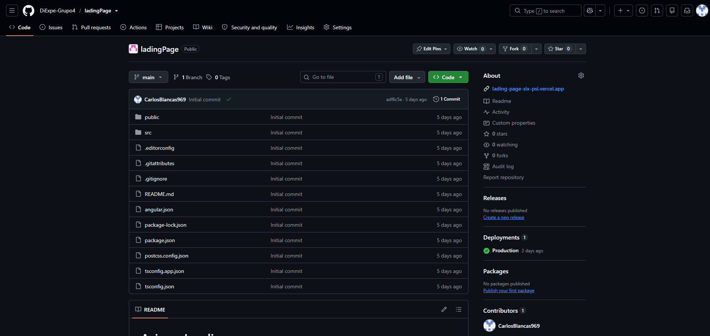

**3\. Visualización de la landing page**

 La página principal del landing de SafeBus tiene un diseño limpio y moderno con un menú superior que enlaza las secciones "Características", "Cómo funciona", "Estadística" y "Apoyo", junto con un botón de ingreso. En la sección hero, destaca el eslogan "Protege tu ruta, asegura tu futuro" y una breve descripción del servicio. También se presentan estadísticas clave, como el porcentaje de rutas seguras operativas y la cantidad de conductores protegidos.

  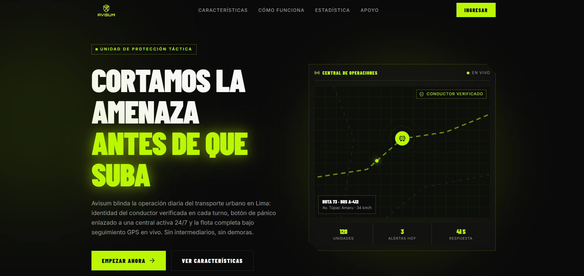

# 5.2. Product Implementation & Deployment

## 5.2.1. Sprint Backlogs

> Completa esta tabla con los sprints reales de tu equipo (Jira, Trello, GitHub Projects, etc.)

📸 *Adjuntar captura del tablero (Jira/Trello/GitHub Projects) de cada sprint.*

---

## 5.2.2. Implemented Landing Page Evidence

**Nombre del proyecto:** Avisum: Sistema de seguridad y monitoreo para transporte público urbano

**URL desplegada:** https://lading-page-six-psi.vercel.app/

**Stack:** React + TypeScript + Vite + Tailwind CSS , desplegado en Vercel 

**Secciones implementadas:**
- Hero con propuesta de valor
- Estadísticas (rutas monitoreadas, conductores protegidos, reducción de incidentes)
- Características (verificación de identidad, botón de pánico, monitoreo GPS)
- Proceso "¿Cómo funciona Avisum?"
- CTA de contacto/demo

* Header y Texto informativo  
 

*  Estadistica
   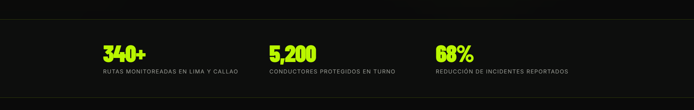

*   Capas de Defensa
    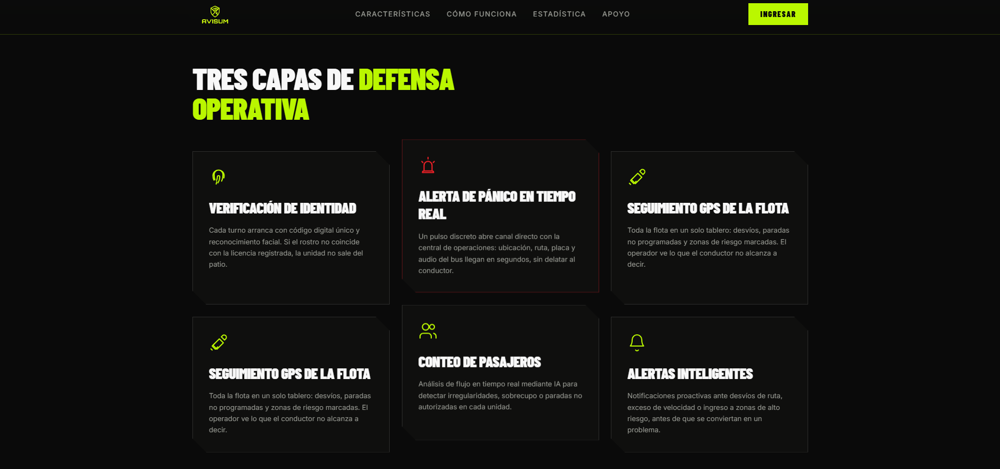

*   Como Funciona Avisum

  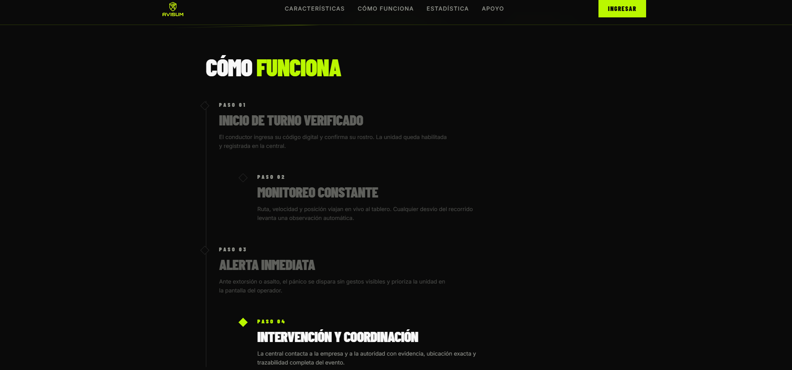
    
 
---

## 5.2.3. Implemented Frontend-Web Application Evidence

**URL desplegada:** `https://avisum-frontend.vercel.app`

**Stack:** Angular (standalone components + signals), estructurado por bounded context (alineado 1 a 1 con el backend):

src/app/
├── iam/ → login, verificación de identidad
├── camera/ → reconocimiento facial (UI)
├── monitoring/ → unidades de bus, turnos, conteo de pasajeros, mapa en vivo
├── alert-management/ → alertas de pánico, historial de alertas
├── profile/ → perfil del conductor
├── users/ → gestión de conductores
└── shared/ → servicios compartidos (tracking de flota en tiempo real)

**Funcionalidades implementadas y conectadas al backend real:**
- Login por código de empleado (`GET /employees/code/{code}`)
- Verificación de identidad y arranque automático de turno
- Dashboard del conductor con métricas en vivo (distancia, tiempo, pasajeros, recaudación)
- Botón de pánico → crea alerta real en el backend
- Panel de administración: asignación de unidades, historial de turnos, logs de alertas
- Mapa en tiempo real (Leaflet/OpenStreetMap) con posición de la unidad

  
* Inicio de Sesion y Verificacion del Conductor

  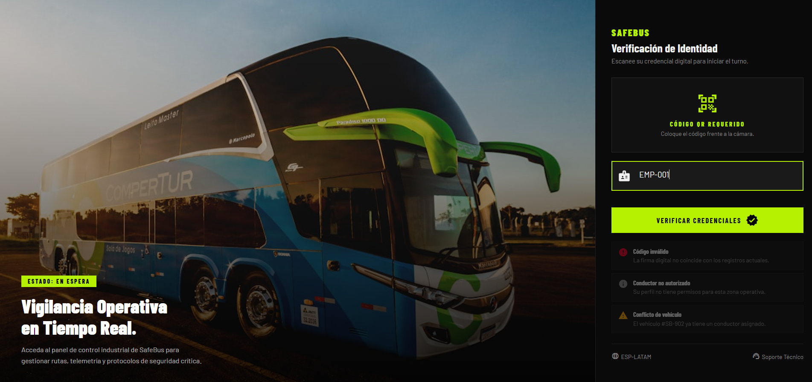
                    
* Dashboard del condcutor

  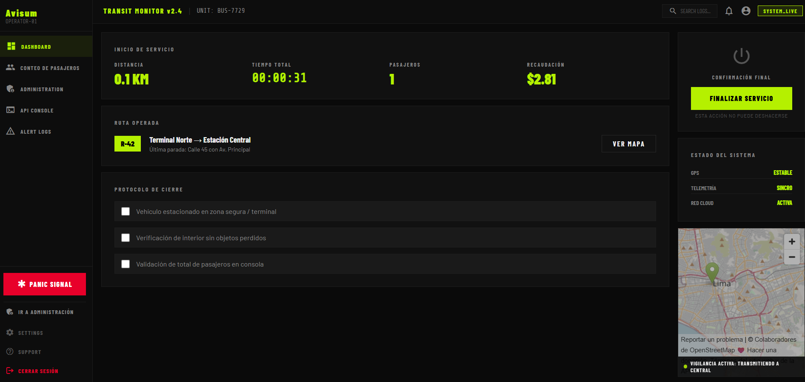

* Mapa del Condcutor

  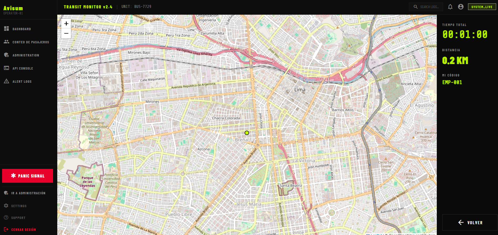

* Alerta de Panico

  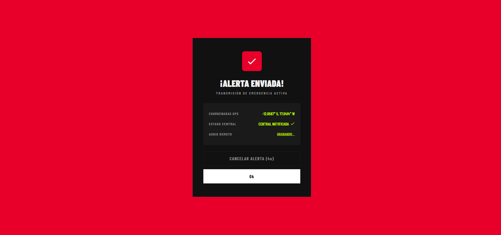

* Servicio Finalizado

  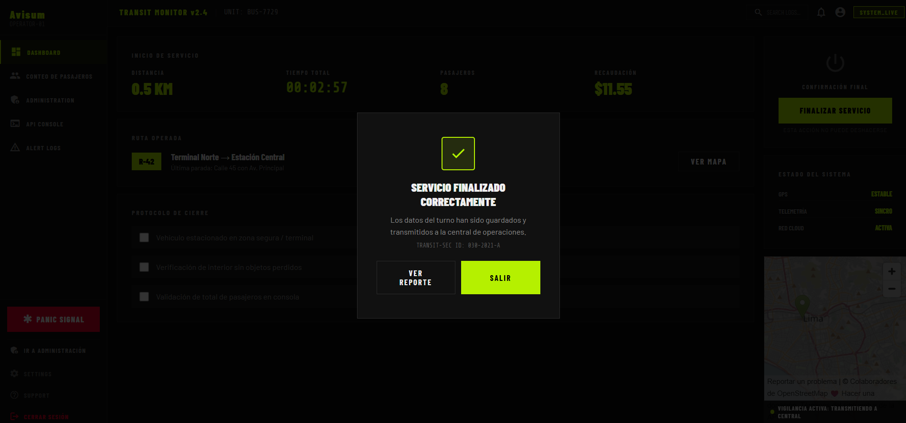

* Reporte del Conductor al finalizzar su turno

  
  
* Panel de administracion , vista del centro de Operaciones

  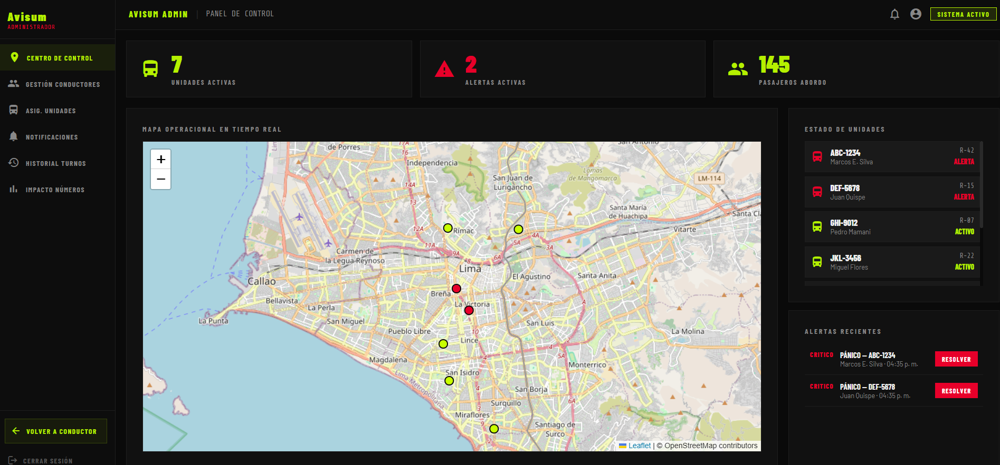

---

## 5.2.4. Acuerdo de Servicio - SaaS

**Avisum** se ofrece como un servicio SaaS (Software as a Service) de suscripción para empresas de transporte público urbano. A continuación se detallan los términos del acuerdo de servicio (SLA - Service Level Agreement) entre Avisum y las empresas cliente.

### Niveles de servicio

| Ítem | Compromiso |
|---|---|
| Disponibilidad objetivo | 99.0% mensual (excluye mantenimiento programado, notificado con 24h de anticipación) |
| Horario de soporte | Lunes a Viernes, 9:00am – 6:00pm (hora Perú) |
| Tiempo de respuesta ante incidente crítico (ej. caída total del sistema, botón de pánico no funcional) | Menor a 4 horas |
| Tiempo de respuesta ante incidente menor (ej. error visual, reporte no crítico) | Menor a 24 horas |
| Retención de datos | Mientras la cuenta esté activa, más 30 días adicionales tras cancelación |
| Backups | Diarios, con retención de 7 días |
| Canal de soporte | Correo soporte@avisum.pe y WhatsApp Business |

### Responsabilidades del proveedor (Avisum)
- Mantener la plataforma operativa según el nivel de disponibilidad acordado.
- Aplicar actualizaciones de seguridad y parches de forma oportuna.
- Notificar con anticipación cualquier mantenimiento programado que implique downtime.
- Resguardar la confidencialidad de los datos de empleados y unidades registradas por el cliente.

### Responsabilidades del cliente (empresa de transporte)
- Mantener actualizada la información de sus conductores y unidades en el sistema.
- Proteger las credenciales de acceso de sus operadores administrativos.
- Reportar de inmediato cualquier incidente de seguridad o uso indebido detectado.
- Usar el sistema conforme a los términos de uso aceptados al momento de la suscripción.

*Nota técnica :* como el backend corre en el plan gratuito de Render, el servicio puede "dormir" tras 15 min de inactividad (primera petición tarda 30-50s en responder). Esto debe mencionarse como limitación conocida del ambiente de despliegue actual, no como parte del SLA comprometido en un entorno de producción real con plan pago.

---

## 5.2.5. Implemented Native-Mobile Application Evidence

A continuación se adjuntan capturas que evidencian la implementación de la aplicación móvil nativa de Avisum. Las imágenes corresponden a pantallas reales y artefactos de desarrollo ubicados en la carpeta `assets/img/nativemobile/`.

- Pantalla de inicio / Login — Interfaz donde el conductor ingresa su código y inicia sesión.

  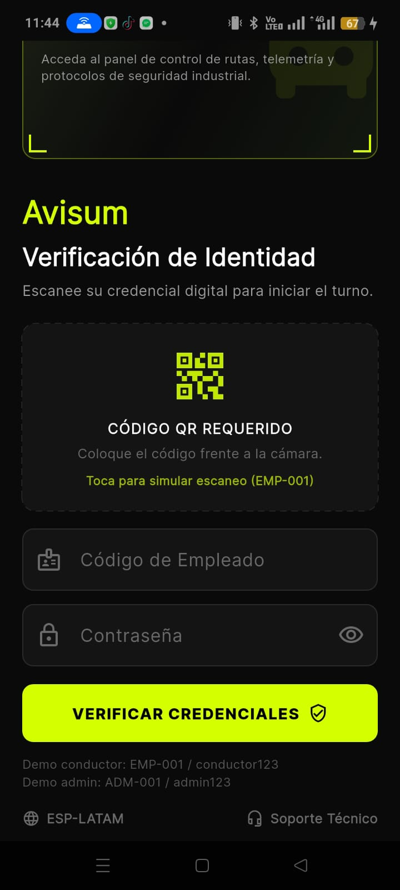

- Pantalla principal (Home) — Vista principal con acceso a las funciones críticas: botón de pánico, estado del servicio y navegación rápida.

  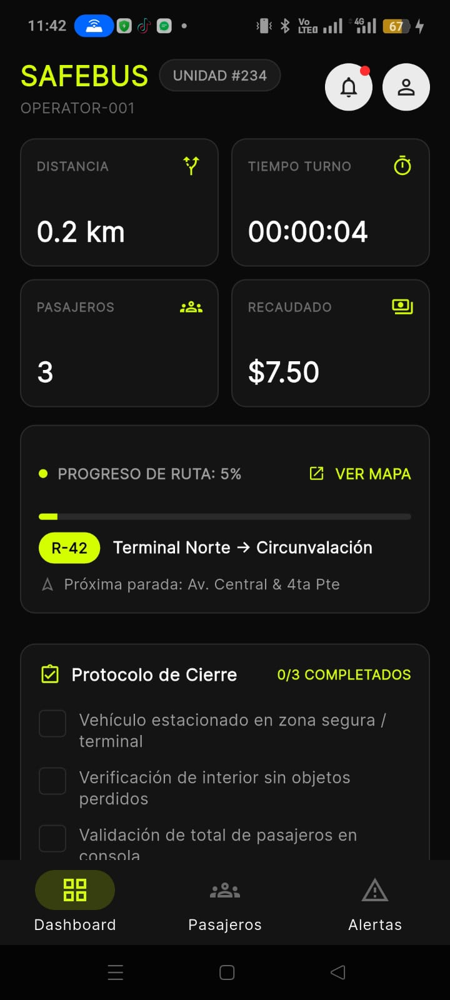

- Registro de pasajeros — Interfaz de conteo y visualización del número de pasajeros durante el turno.

  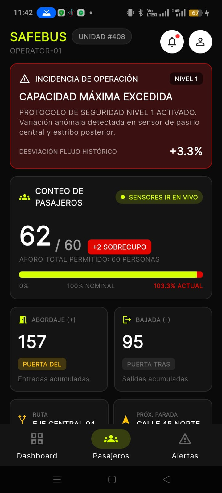

- Perfil del conductor — Información del perfil, historial y configuración personal.

  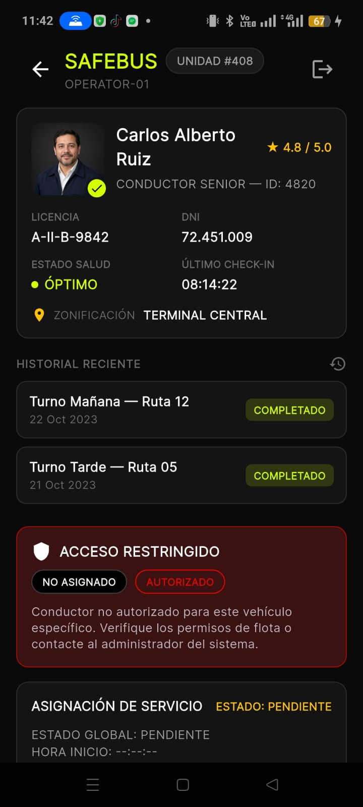

- Escaneo / Verificación — Pantalla utilizada para verificación rápida (por ejemplo escaneo de credenciales o QR).

  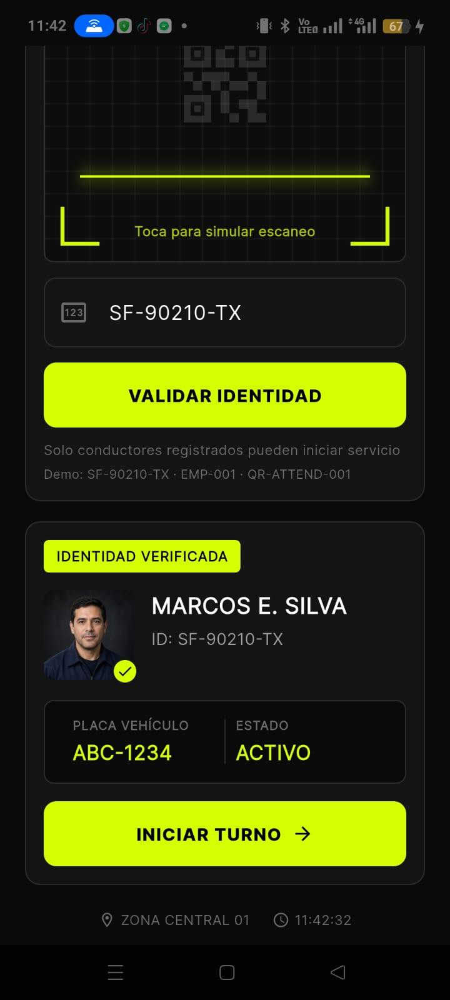

- Alerta enviada — Confirmación visual de que la alerta de pánico fue enviada correctamente.

  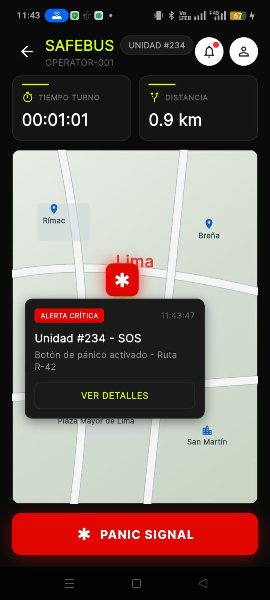

- Alerta (pantalla de preparación) — Estado previo al envío de una alerta.

  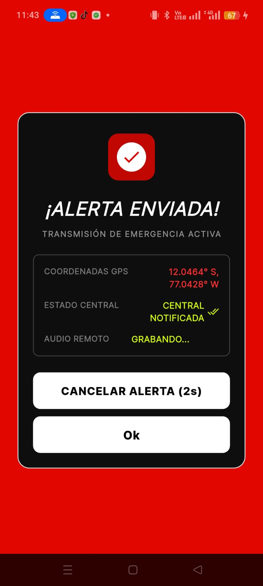

- Entorno de desarrollo — Captura de Android Studio con la app en ejecución (evidencia del proceso de construcción y pruebas en emulador/dispositivo).

  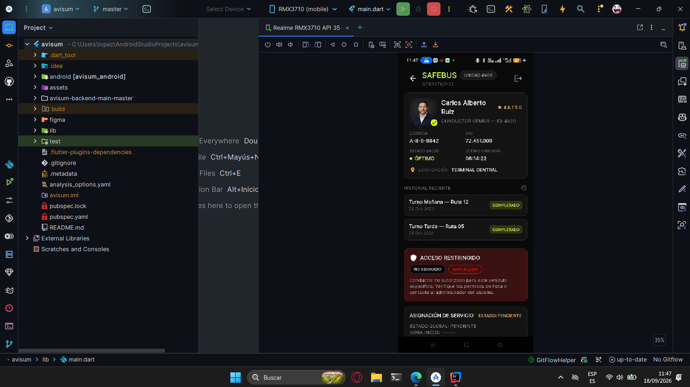

Estas imágenes constituyen la evidencia visual de la aplicación móvil: flujo de autenticación, control de turnos y pasajeros, proceso de verificación y envío de alertas. Si prefieres que usemos otra carpeta (por ejemplo `assets/mimg/native/mobile/`) puedo mover o duplicar las imágenes y actualizar las rutas en este documento — indícame exactamente la ruta que quieres usar.

---

## 5.2.6. Implemented RESTful API and/or Serverless Backend Evidence

**URL desplegada:** `https://avisum-backendv2.onrender.com`

**Stack:** Spring Boot (Java), arquitectura DDD + CQRS, base de datos H2 (modo compatible MySQL), documentación автоgenerada con Springdoc/OpenAPI.

**Bounded contexts implementados:**

| Bounded Context | Responsabilidad | Aggregates |
|---|---|---|
| `iam` | Identidad y autenticación de empleados | `Employee` |
| `usermanagement` | Gestión de conductores | `Driver` |
| `monitoring` | Flota, turnos y conteo de pasajeros | `BusUnit`, `Sensor`, `Shift`, `PassengerCount` |
| `alertmanagement` | Alertas de seguridad | `Alert` |
| `camera` | Reconocimiento facial de conductores | `FaceVerification` |
| `profiles` | Perfil del conductor | `DriverProfile` |

**Seguridad implementada:**
- Contraseñas hasheadas con BCrypt (nunca texto plano)
- Bloqueo temporal de cuenta tras 5 intentos fallidos de login (15 min)
- Login real con validación de credenciales (`POST /employees/login`)
- Validación cruzada entre bounded contexts (ej. no se puede registrar un sensor en una unidad inexistente)

**Despliegue:** contenedor Docker (multi-stage build, `eclipse-temurin:26`), desplegado en Render.

* Backend Deploy

  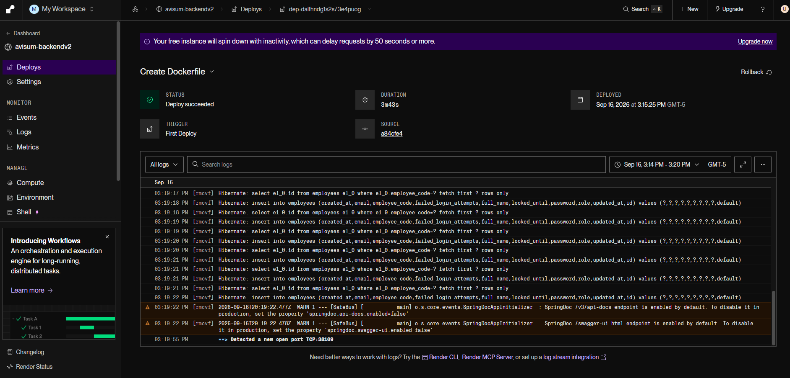
  
* Swagger, Backend en produccion
  
  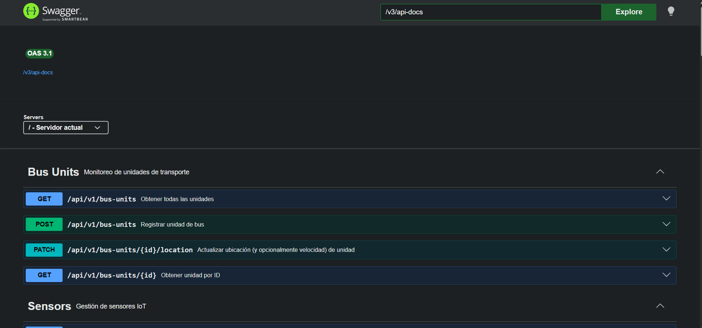
---

## 5.2.7. RESTful API documentation

**Documentación interactiva (Swagger/OpenAPI):** `https://avisum-backendv2.onrender.com/swagger-ui/index.html`

### Endpoints principales

**Employees (IAM)**
| Método | Endpoint | Descripción |
|---|---|---|
| POST | `/api/v1/employees` | Crear empleado |
| POST | `/api/v1/employees/login` | Login con validación de password |
| GET | `/api/v1/employees` | Listar empleados |
| GET | `/api/v1/employees/{id}` | Obtener empleado por ID |
| GET | `/api/v1/employees/code/{employeeCode}` | Obtener empleado por código |

**Drivers (UserManagement)**
| Método | Endpoint | Descripción |
|---|---|---|
| POST | `/api/v1/drivers` | Registrar conductor |
| GET | `/api/v1/drivers` | Listar conductores |
| GET | `/api/v1/drivers/{id}` | Obtener conductor por ID |

**Bus Units (Monitoring)**
| Método | Endpoint | Descripción |
|---|---|---|
| POST | `/api/v1/bus-units` | Registrar unidad |
| GET | `/api/v1/bus-units` | Listar unidades (incluye conductor asignado y conteo de pasajeros en vivo) |
| GET | `/api/v1/bus-units/{id}` | Obtener unidad por ID |
| PATCH | `/api/v1/bus-units/{id}/location` | Actualizar ubicación y velocidad |

**Sensors (Monitoring)**
| Método | Endpoint | Descripción |
|---|---|---|
| POST | `/api/v1/sensors` | Registrar sensor |
| GET | `/api/v1/sensors` | Listar sensores |
| GET | `/api/v1/sensors/{id}` | Obtener sensor por ID |
| GET | `/api/v1/sensors/bus-unit/{busUnitId}` | Sensores de una unidad |
| PATCH | `/api/v1/sensors/{id}/reading` | Actualizar lectura |

**Shifts (Monitoring)**
| Método | Endpoint | Descripción |
|---|---|---|
| POST | `/api/v1/shifts` | Iniciar turno |
| PATCH | `/api/v1/shifts/{id}/end` | Finalizar turno |
| GET | `/api/v1/shifts` | Listar turnos |
| GET | `/api/v1/shifts/{id}` | Obtener turno por ID |
| GET | `/api/v1/shifts/employee/{employeeId}` | Historial de turnos de un conductor |
| GET | `/api/v1/shifts/bus-unit/{busUnitId}/active` | Turno activo de una unidad |

**Passenger Counts (Monitoring)**
| Método | Endpoint | Descripción |
|---|---|---|
| POST | `/api/v1/passenger-counts` | Registrar lectura de conteo |
| GET | `/api/v1/passenger-counts` | Listar lecturas |
| GET | `/api/v1/passenger-counts/shift/{shiftId}` | Lecturas de un turno |

**Alerts (AlertManagement)**
| Método | Endpoint | Descripción |
|---|---|---|
| POST | `/api/v1/alerts` | Crear alerta de seguridad |
| GET | `/api/v1/alerts` | Listar alertas |
| GET | `/api/v1/alerts/{id}` | Obtener alerta por ID |
| GET | `/api/v1/alerts/employee/{employeeId}` | Alertas de un empleado |
| PATCH | `/api/v1/alerts/{id}/resolve` | Resolver alerta |

**Face Verifications (Camera)**
| Método | Endpoint | Descripción |
|---|---|---|
| POST | `/api/v1/face-verifications` | Verificar rostro de un conductor |
| GET | `/api/v1/face-verifications` | Listar verificaciones |
| GET | `/api/v1/face-verifications/{id}` | Obtener verificación por ID |
| GET | `/api/v1/face-verifications/employee/{employeeId}` | Historial de un empleado |

**Driver Profiles (Profiles)**
| Método | Endpoint | Descripción |
|---|---|---|
| POST | `/api/v1/driver-profiles` | Crear perfil |
| GET | `/api/v1/driver-profiles` | Listar perfiles |
| GET | `/api/v1/driver-profiles/{id}` | Obtener perfil por ID |
| GET | `/api/v1/driver-profiles/employee/{employeeId}` | Perfil por empleado |
| PATCH | `/api/v1/driver-profiles/employee/{employeeId}` | Actualizar perfil |

---

## 5.2.8. Team Collaboration Insights

**Repositorios:**
- Backend: `github.com/DiExpe-Grupo4/avisum-backendv2`
- Frontend: `github.com/DiExpe-Grupo4/Avisum-Frontend`

**Flujo de trabajo colaborativo:**
- Backend y frontend en repositorios separados, cada uno responsable de su capa.
- Integración mediante contrato de API documentado en Swagger — el frontend consume el backend ya probado en Swagger antes de conectarse.
- Verificación cruzada de bounded contexts en el backend para mantener integridad referencial entre módulos (ej. IAM ↔ Monitoring ↔ Camera).

📸 *Adjuntar captura de la pestaña "Insights" de cada repositorio en GitHub (Contributors, Commits over time, Code frequency).*

**Miembros del equipo:** :

//IMAGEN A INSERTAR
