# Capitulo VI: Product Verification & Validation
## 6.1. Testing Suites & Validation
### 6.1.1. Core Entities Unit Tests.

Las pruebas unitarias de las core entities son fundamentales en el desarrollo de software, ya que permiten verificar su correcto funcionamiento, detectar errores de manera temprana y facilitar el mantenimiento del código.

**Alert Test**

**Face Verification Test**

**Employee Test**

**Bus Unit Test**

**Passenger Count Test**

**Sensor Test**

**Shift Test**

**Driver Profile Test**

### 6.1.2. Core Integration Tests.

Las Core Integration Tests son esenciales para verificar que los controladores funcionen correctamente junto con otros componentes del sistema, como los servicios y las bases de datos. Además, permiten evaluar escenarios de error para comprobar que el sistema gestione adecuadamente situaciones inesperadas y devuelva los códigos de estado correspondientes. Esto contribuye a mejorar la experiencia del usuario, facilitar la detección de errores y garantizar un software más confiable y de calidad.

**Employees Api Integration Test**

**Bus Units Api Integration Test**

**Shifts Api Integration Test**

**Alerts Api Integration Test**

### 6.1.3. Core Behavior-Driven Development

El Behavior-Driven Development (BDD) permite validar el comportamiento del sistema a partir de escenarios que representan situaciones reales de uso. Estas pruebas ayudan a comprobar que las funcionalidades implementadas respondan correctamente a las necesidades definidas en los requerimientos, utilizando criterios claros y comprensibles para el equipo de desarrollo y los usuarios.

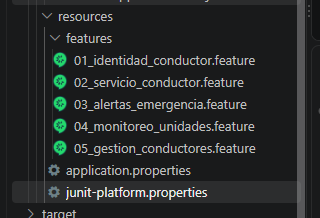

**Identidad y autorización del conductor**

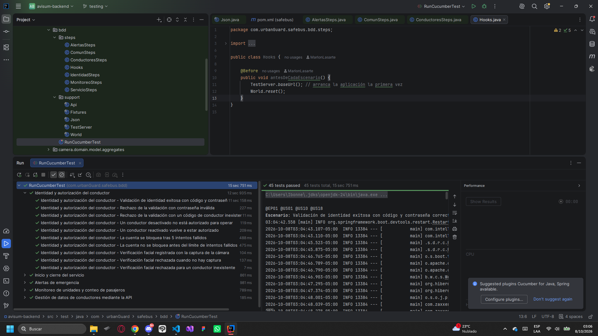

**Inicio y cierre del servicio**

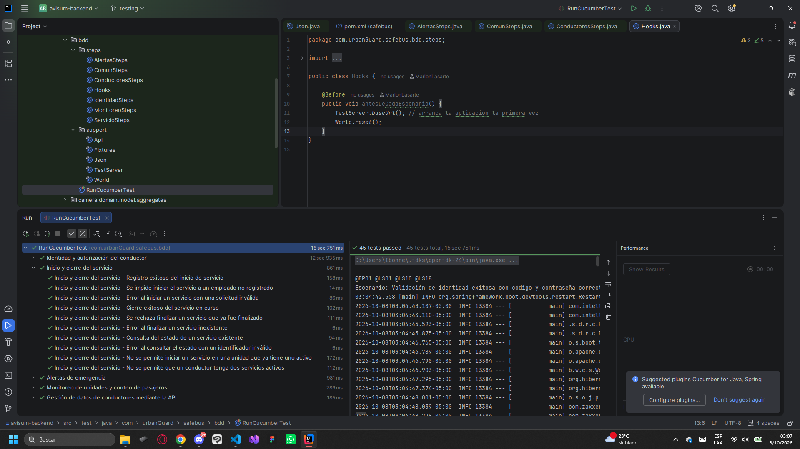

**Alertas de emergencia**

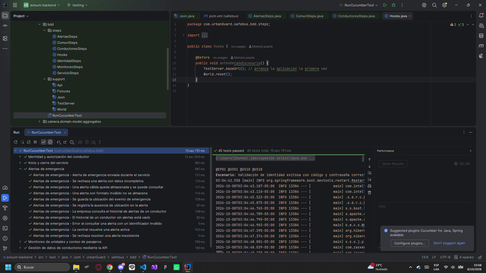

**Monitoreo de unidades y conteo de pasajeros**

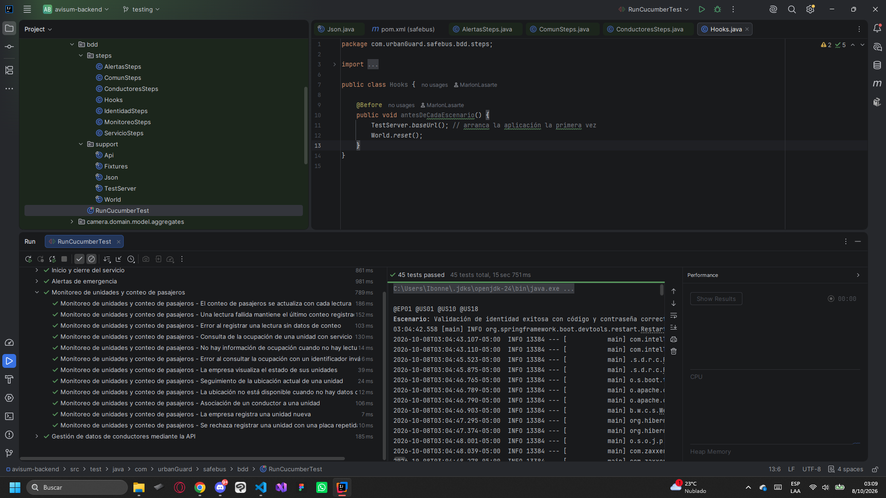

**Gestión de conoductores mediante Api**

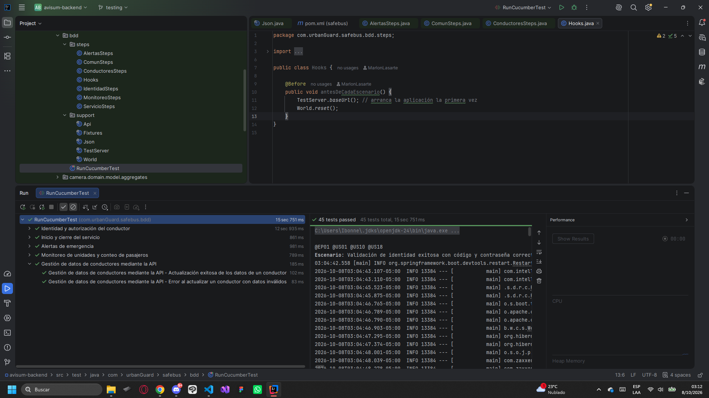

### 6.1.4. Core System Tests.

Las Core System Tests permiten evaluar el funcionamiento completo del sistema, verificando la interacción entre sus principales componentes y funcionalidades. Estas pruebas buscan comprobar que el producto cumpla con los requerimientos establecidos y que los flujos principales se ejecuten correctamente en escenarios similares a los de un entorno real.

#### Entorno y herramienta de prueba

Las pruebas se ejecutaron de punta a punta sobre el sistema desplegado (frontend, backend y base de datos), simulando las acciones de un usuario real desde el navegador.

| Elemento | Detalle |
|---|---|
| Herramienta | Selenium IDE (extensión de Microsoft Edge) |
| Navegador | Microsoft Edge |
| Frontend web | `https://avisum-frontend.vercel.app` |
| Landing page | `https://lading-page-six-psi.vercel.app/` |
| Backend | `https://avisum-backendv2.onrender.com` |
| Alcance | Aplicación web (frontend Angular y landing page). La aplicación móvil nativa queda fuera del alcance de estas pruebas |

**Precondiciones de ejecución**

- El backend se despierta antes de iniciar (abriendo su Swagger y esperando la respuesta), porque el plan gratuito de Render lo suspende tras 15 minutos de inactividad y la primera petición tarda entre 30 y 50 segundos.
- Se utiliza el código de empleado de prueba `EMP-001`.
- Cada prueba incluye pausas explícitas entre pasos, para dar tiempo a que responda el backend.

**Orden de ejecución:** ST-02, ST-04, ST-01, ST-03, ST-05, ST-06, ST-07, ST-09, ST-10, ST-08, ST-11 y ST-12. ST-07 genera una alerta real y ST-08 cierra el turno, por lo que se ejecutan en ese orden.

#### Criterio de selección

Cada prueba se deriva de una historia de usuario del Capítulo 3, usando sus escenarios de éxito y de fracaso (Given/When/Then), y recorre un flujo definido en los user flows y el prototipo del Capítulo 4. Las historias de tipo developer (endpoints) ya están cubiertas por las pruebas de integración de la sección 6.1.2.

#### Plan de pruebas

| ID | Historias | Escenario | Resultado esperado |
|---|---|---|---|
| ST-01 | US01, US14 | Login con código de conductor válido | El sistema valida el código y muestra la pantalla de acceso autorizado |
| ST-02 | US01 | Login con código inexistente | El sistema rechaza el acceso y permanece en la pantalla de verificación |
| ST-03 | US02, US15 | Verificación de identidad y arranque del servicio | Se abre el dashboard del conductor con la unidad asignada |
| ST-04 | US02 | Acceso al dashboard sin haberse validado | El sistema impide el acceso y redirige al login |
| ST-05 | US06, US07 | Dashboard del conductor en servicio | Se muestran distancia, tiempo, pasajeros y recaudación |
| ST-06 | US28 | Mapa en tiempo real | Se muestra el mapa con la posición de la unidad |
| ST-07 | US03, US04, US19 | Botón de pánico con servicio activo | Se muestra la confirmación de alerta enviada |
| ST-08 | US20 | Finalizar el servicio | Se muestra la confirmación de servicio finalizado |
| ST-09 | US04, US21 | Panel de administración | El panel carga y muestra unidades y alertas recientes |
| ST-10 | US16 | Historial de alertas del administrador | Se muestra el registro de alertas |
| ST-11 | US08, US09, US25, US29 | Contenido de la landing page | Las secciones informativas son visibles |
| ST-12 | US17 | Navegación entre secciones de la landing | Cada enlace del menú lleva a su sección |

#### Detalle de los casos de prueba

**ST-01 — Login con código válido** (US01, US14)

Se abre la pantalla de verificación de identidad (`/conductor/login`), se ingresa el código de empleado `EMP-001` y se pulsa "Verificar credenciales". Luego de una pausa para dar tiempo de respuesta al backend, se verifica que aparezca el título "Acceso Autorizado".

- **Resultado esperado:** el sistema valida el código y muestra la pantalla de acceso autorizado.
- **Resultado obtenido:** ✅ Pasó.
- **Observación:** la pantalla de acceso autorizado también muestra textos propios de una alerta ("Transmisión de emergencia activa", "Central notificada", "Audio remoto: grabando"). Conviene revisar si es el comportamiento previsto.

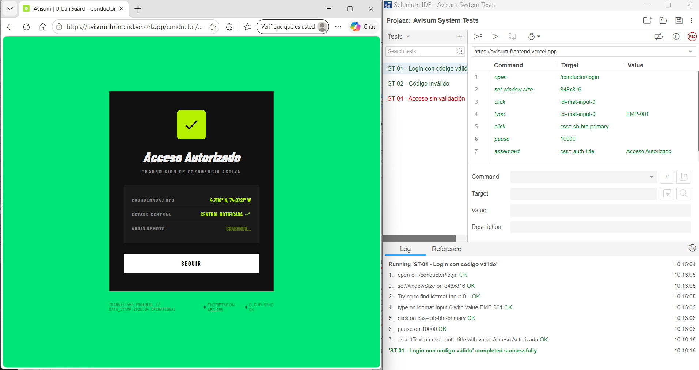

**ST-02 — Código inválido** (US01)

Se ingresa un código inexistente (`xxxx000`) en la pantalla de verificación y se pulsa "Verificar credenciales". Luego de una pausa de 8 segundos, se verifica que la ruta siga siendo `/conductor/login`, es decir, que el sistema no avanzó.

- **Resultado esperado:** el sistema rechaza el acceso y permanece en la pantalla de verificación.
- **Resultado obtenido:** ✅ Pasó.
- **Nota:** la prueba valida que el sistema no avanza con un código falso. No distingue visualmente un mensaje de error, porque los tres avisos de la pantalla ("Código inválido", "Conductor no autorizado" y "Conflicto de vehículo") se ven igual antes y después del intento.

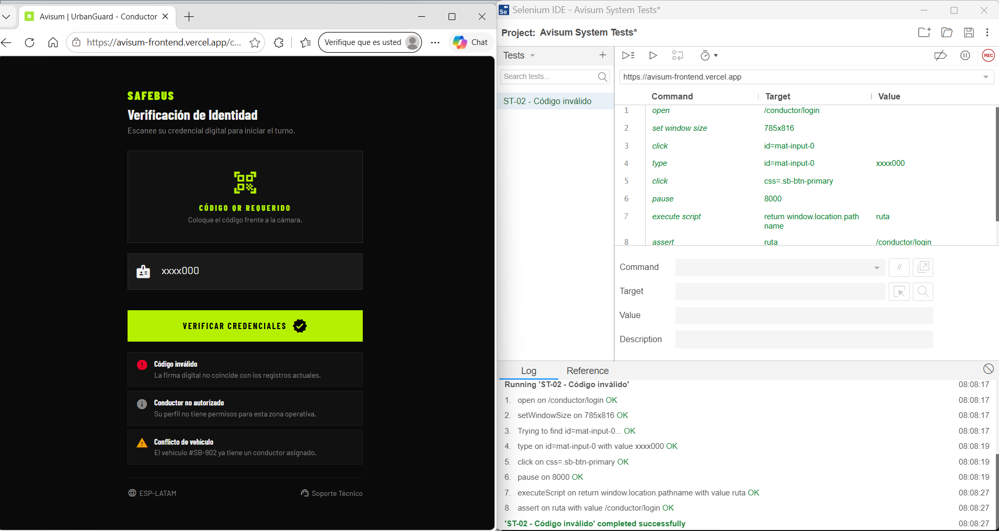

**ST-03 — Verificación e inicio de servicio** (US02, US15)

Se verifica la identidad con `EMP-001`, se espera la pantalla de acceso autorizado y se pulsa "Seguir". Luego de las pausas correspondientes, se verifica que cargue el dashboard del conductor, comprobando su encabezado "TRANSIT MONITOR v2.4".

- **Resultado esperado:** se abre el dashboard del conductor con la unidad asignada.
- **Resultado obtenido:** ✅ Pasó.
- **Nota:** la prueba confirma que se llega al dashboard. No verifica por sí sola que el turno quede registrado, ya que el tiempo total se mostraba en `00:00:00`.

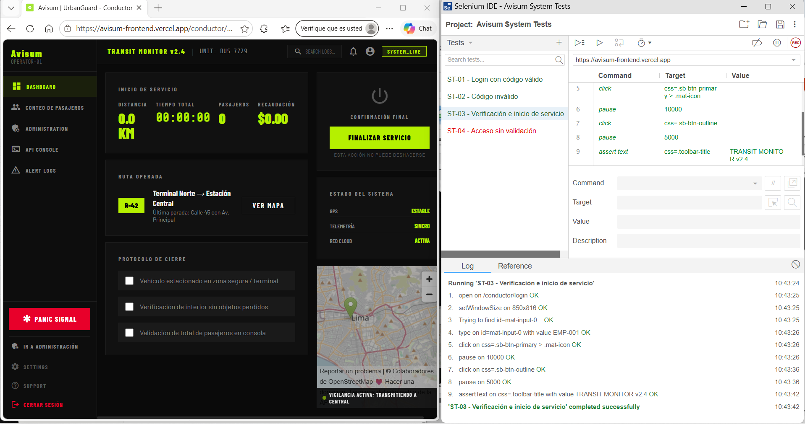

**ST-04 — Acceso sin validación** (US02)

Sin sesión iniciada, se abre directamente la ruta `/conductor/dashboard`. Luego de una pausa de 5 segundos, se verifica que el sistema haya redirigido al login (`/conductor/login`).

- **Resultado esperado:** el sistema impide el acceso y redirige al login.
- **Resultado obtenido:** ❌ Falló. La ruta se mantuvo en `/conductor/dashboard` y el dashboard cargó completo, sin pasar por la verificación.
- **Verificación adicional:** la comprobación se repitió manualmente en una ventana InPrivate, sin ninguna sesión guardada, con el mismo resultado. Esto descarta que el acceso se debiera a una sesión previa del navegador.
- **Hallazgo:** el sistema permite abrir el dashboard sin verificación previa, lo que contradice el escenario de fracaso de la historia US02.

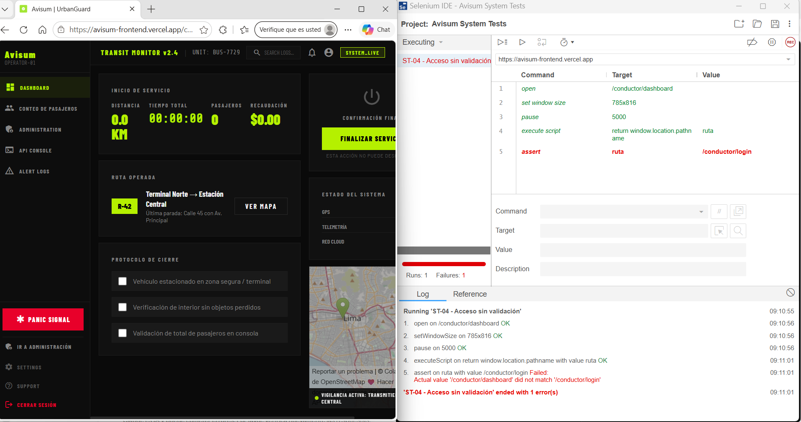

**ST-05 — Dashboard del conductor** (US06, US07)

Con el servicio iniciado desde la verificación, se comprueba que el dashboard muestre las etiquetas de las cuatro métricas: Distancia, Tiempo total, Pasajeros y Recaudación.

- **Resultado esperado:** se muestran las cuatro métricas del servicio.
- **Resultado obtenido:** ✅ Pasó.
- **Nota:** la prueba comprueba que las métricas están presentes en pantalla, no que se actualicen en vivo.

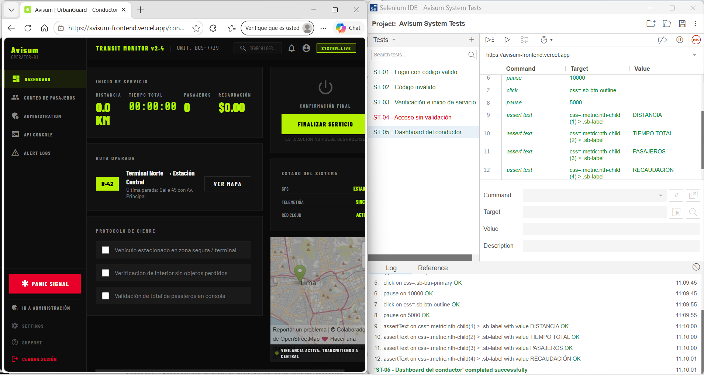

**ST-06 — Mapa en tiempo real** (US28)

Desde el dashboard, la prueba entra al marco que contiene el mapa y verifica que su lienzo (`maplibregl-canvas`) esté presente.

- **Resultado esperado:** se muestra el mapa con la posición de la unidad.
- **Resultado obtenido:** ✅ Pasó. El mapa se carga y se aprecia un marcador sobre Lima.
- **Nota:** el mapa del dashboard del conductor usa MapLibre, mientras que el del panel de administración usa Leaflet.

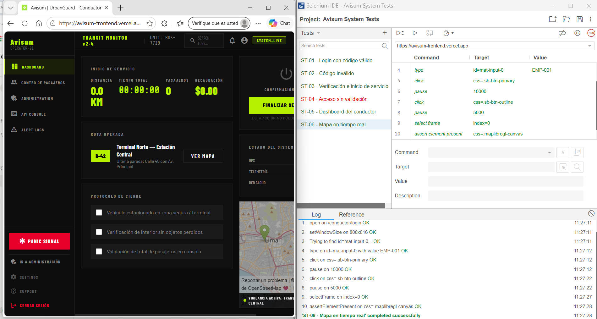

**ST-07 — Botón de pánico** (US03, US04, US19)

Con el servicio activo, se pulsa "Panic Signal", se espera la respuesta del backend y se verifica que aparezca el título "¡ALERTA ENVIADA!".

- **Resultado esperado:** se crea la alerta y se muestra la confirmación de alerta enviada.
- **Resultado obtenido:** ✅ Pasó. Al generar una alerta de pánico, esta queda registrada en "Alert Logs" (tipo Pánico, nivel Crítico, estado Activa), verificado manualmente.
- **Observaciones:** la alerta se envía sin ventana de confirmación previa, que el prototipo del Capítulo 4 sí contemplaba. Además, la pantalla ofrece un botón "Cancelar alerta" que no figura en las historias del Capítulo 3.
- **Nota:** cada ejecución crea una alerta real en el backend.

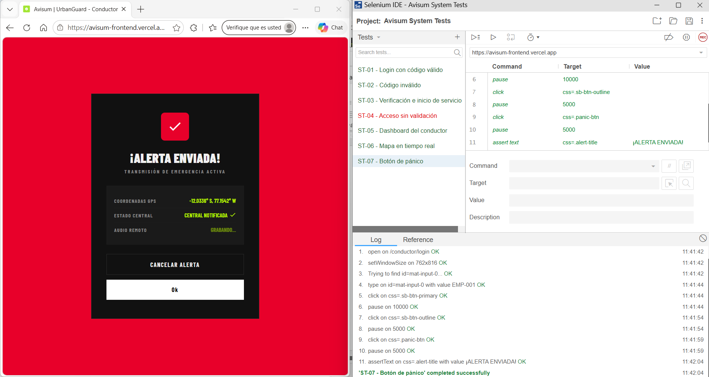

**ST-08 — Finalizar servicio** (US20)

Con el servicio activo, se marcan las tres casillas del protocolo de cierre, se pulsa "Finalizar servicio" y se verifica que aparezca la ventana de confirmación "Servicio finalizado correctamente".

- **Resultado esperado:** se registra el cierre y se muestra la confirmación de servicio finalizado.
- **Resultado obtenido:** ✅ Pasó.
- **Nota:** la prueba verifica que la ventana de confirmación aparece. Una comparación literal del texto del título no coincidió pese a verse idéntico en pantalla, y no se identificó la causa, por lo que la verificación se hizo sobre la existencia del elemento. Cada ejecución cierra un turno.

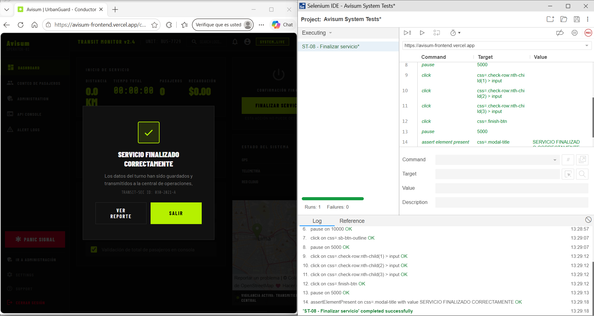

**ST-09 — Panel de administración** (US04, US21)

Desde la sesión de `EMP-001`, se pulsa "Administration" y se verifica que cargue el panel ("AVISUM ADMIN") y que exista la sección "Alertas recientes".

- **Resultado esperado:** el panel carga y muestra las unidades y las alertas recientes.
- **Resultado obtenido:** ✅ Pasó.
- **Nota:** las cifras del panel (unidades activas, alertas activas y pasajeros a bordo) variaron entre ejecuciones sin intervención, por lo que la prueba no verifica valores concretos ni la alerta específica generada en ST-07. En una carga con cero alertas, la sección "Alertas recientes" se mostró vacía, sin ningún mensaje.

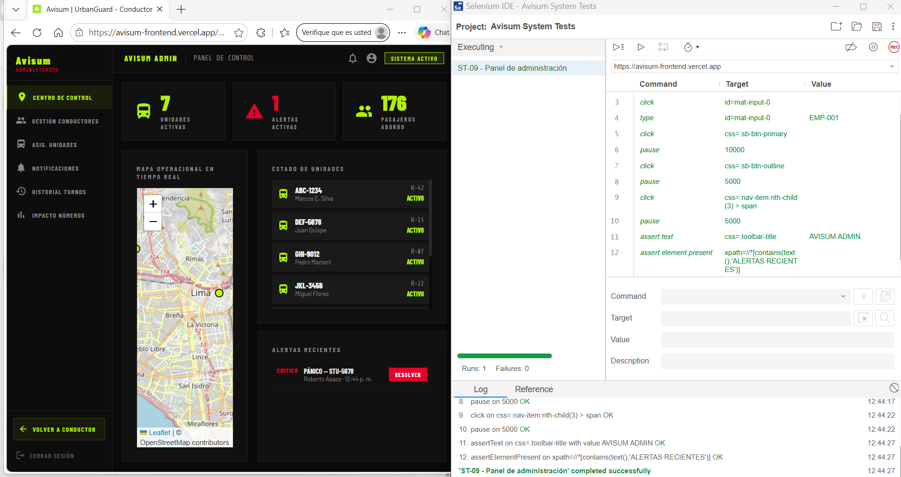

**ST-10 — Historial de alertas** (US16)

En el panel de administración se pulsa "Notificaciones" y se verifica que exista el "Registro de entregas", que lista los eventos de alerta (pánico, velocidad, sobrecapacidad y desvío).

- **Resultado esperado:** se muestra el registro de eventos de alerta.
- **Resultado obtenido:** ✅ Pasó.
- **Nota:** esta es la pantalla del panel de administración que más se acerca a lo que describe US16. La pantalla "Alert Logs" del conductor también incluye una tabla "Historial de alertas", que no fue cubierta por esta prueba. Los datos del registro de entregas parecen fijos (por ejemplo, la unidad GHI-9012), por lo que no se verifican entradas concretas.

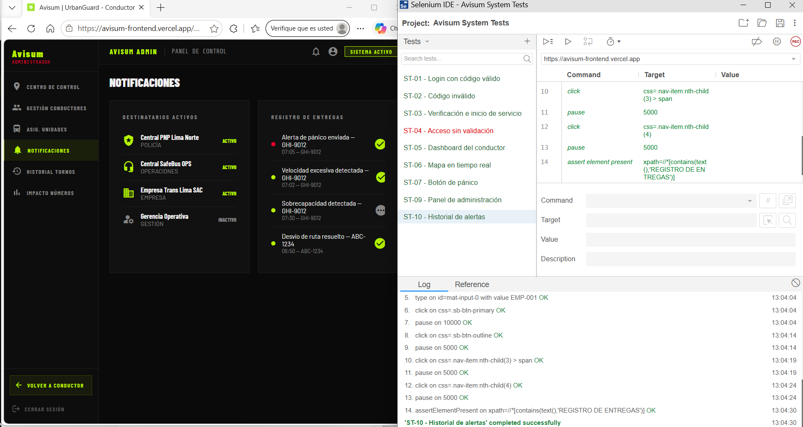

**ST-11 — Contenido de la landing** (US08, US09, US25, US29)

Se abre la landing page y se verifica la presencia de sus secciones principales: el encabezado, la cifra "340+", "Tres capas de defensa operativa", "Cómo funciona", "Solicita una auditoría de seguridad para tu flota" y el pie de página.

- **Resultado esperado:** las secciones informativas son visibles.
- **Resultado obtenido:** ✅ Pasó.
- **Cobertura de historias:** US08, US09 y US25 quedan cubiertas, y US29 de forma parcial (a través de las cifras). Las historias US22, US23 y US30 (segmento de clientes, misión y visión, y equipo de trabajo) no se encontraron en la landing, por lo que no se probaron.

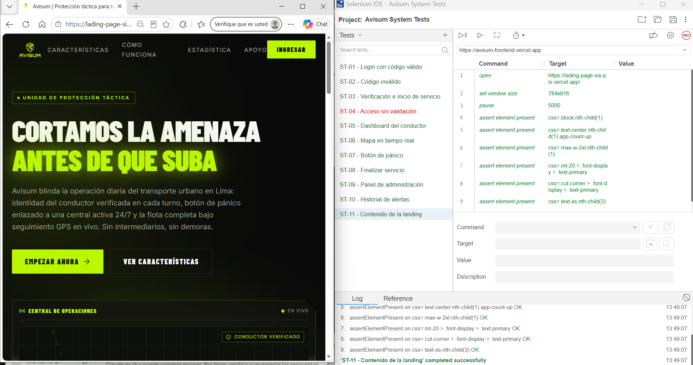

**ST-12 — Navegación de la landing** (US17)

Se pulsa cada enlace del menú superior (Características, Cómo funciona, Estadística y Apoyo) y, tras una pausa, se verifica que exista el elemento de la sección correspondiente. "Apoyo" lleva a la sección "Solicita una auditoría de seguridad para tu flota".

- **Resultado esperado:** cada enlace del menú lleva a su sección.
- **Resultado obtenido:** ✅ Pasó.
- **Nota:** la prueba comprueba que el elemento de cada sección existe tras pulsar el enlace, no el desplazamiento de la página.

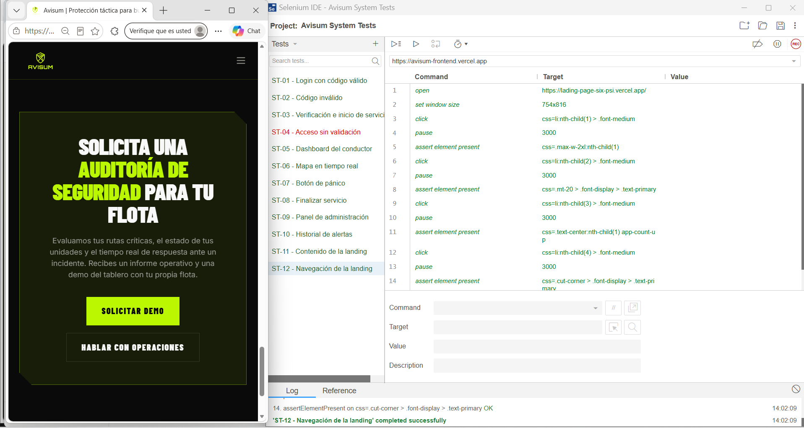

#### Resumen de resultados

| ID | Escenario | Historias | Resultado |
|---|---|---|---|
| ST-01 | Login con código válido | US01, US14 | ✅ Pasó |
| ST-02 | Código inválido | US01 | ✅ Pasó |
| ST-03 | Verificación e inicio de servicio | US02, US15 | ✅ Pasó |
| ST-04 | Acceso sin validación | US02 | ❌ Falló |
| ST-05 | Dashboard del conductor | US06, US07 | ✅ Pasó |
| ST-06 | Mapa en tiempo real | US28 | ✅ Pasó |
| ST-07 | Botón de pánico | US03, US04, US19 | ✅ Pasó |
| ST-08 | Finalizar servicio | US20 | ✅ Pasó |
| ST-09 | Panel de administración | US04, US21 | ✅ Pasó |
| ST-10 | Historial de alertas | US16 | ✅ Pasó |
| ST-11 | Contenido de la landing | US08, US09, US25, US29 | ✅ Pasó |
| ST-12 | Navegación de la landing | US17 | ✅ Pasó |

De las 12 pruebas ejecutadas, 11 pasaron y 1 falló.

#### Hallazgos y observaciones

**Hallazgo confirmado**

- **ST-04:** la ruta `/conductor/dashboard` es accesible sin verificación previa, incluso en una ventana sin sesión guardada.

**Observaciones por revisar**

- La pantalla de acceso autorizado muestra textos de alerta de emergencia (ST-01).
- El botón de pánico envía la alerta sin ventana de confirmación y la pantalla incluye un botón "Cancelar alerta" que no figura en las historias de usuario (ST-07).
- Las cifras del panel de administración cambian entre cargas y la sección de alertas recientes quedó vacía, sin mensaje, en una de ellas (ST-09).
- Las historias US22, US23 y US30 no tienen una sección equivalente en la landing page (ST-11).
- El producto aparece con tres nombres distintos: "Avisum" en la landing y los capítulos, "SafeBus" en la pantalla de verificación y "UrbanGuard" en el título de la pestaña del frontend.

#### Limitaciones

- El backend corre en el plan gratuito de Render, por lo que la primera ejecución tras un periodo de inactividad puede fallar por tiempo de espera. Por eso se despierta el servicio antes de correr las pruebas y se usan pausas explícitas.
- Las pruebas del panel de administración no verifican cifras ni alertas concretas, porque los datos mostrados cambian entre ejecuciones.
- Las pruebas cubren la aplicación web; la aplicación móvil nativa no se probó con Selenium.

