# Capitulo VI: Product Verification & Validation
## 6.1. Testing Suites & Validation
### 6.1.1. Core Entities Unit Tests.

Las pruebas unitarias de las core entities son fundamentales en el desarrollo de software, ya que permiten verificar su correcto funcionamiento, detectar errores de manera temprana y facilitar el mantenimiento del código.

**Alert Test**

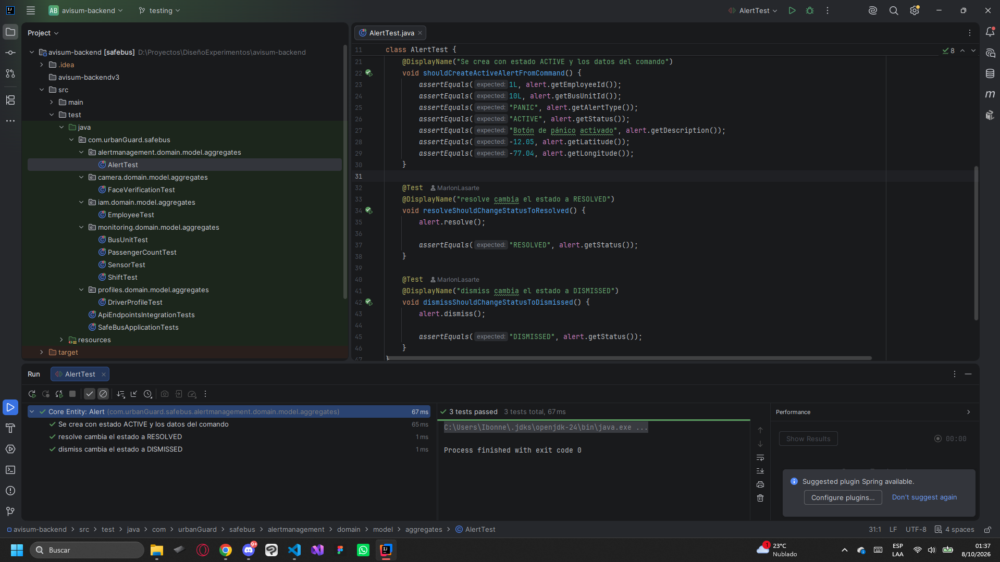

**Face Verification Test**

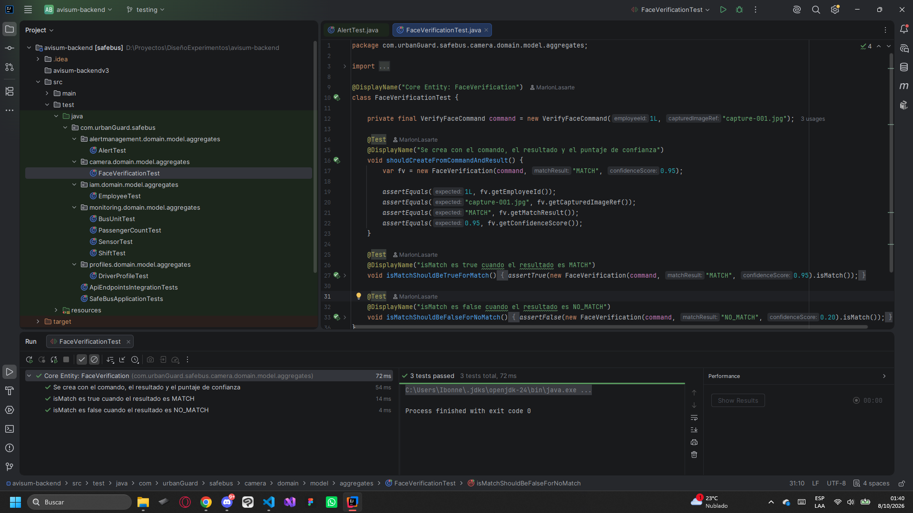

**Employee Test**

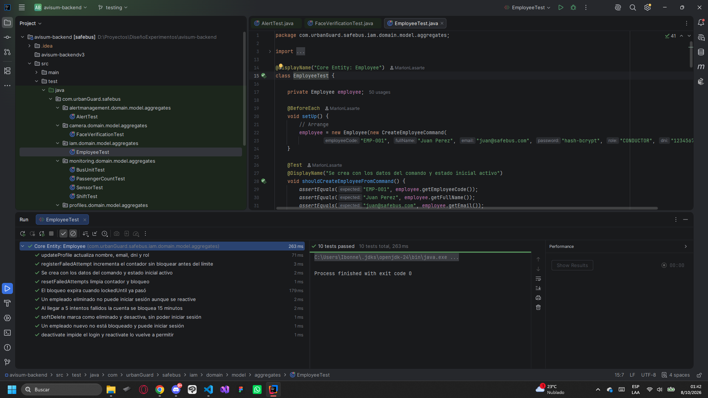

**Bus Unit Test**

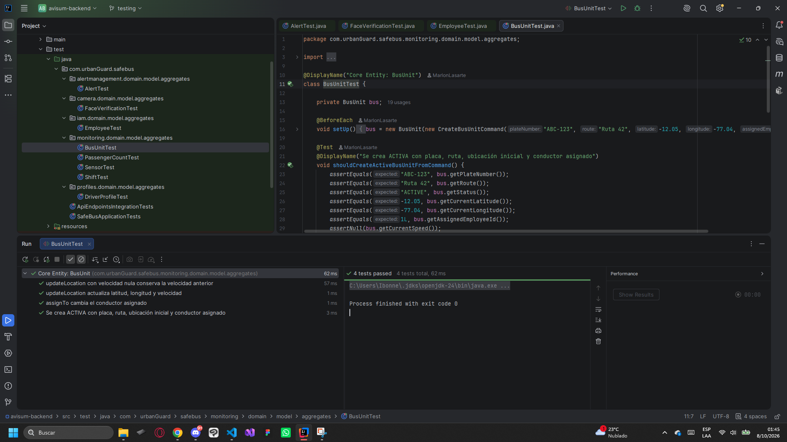

**Passenger Count Test**

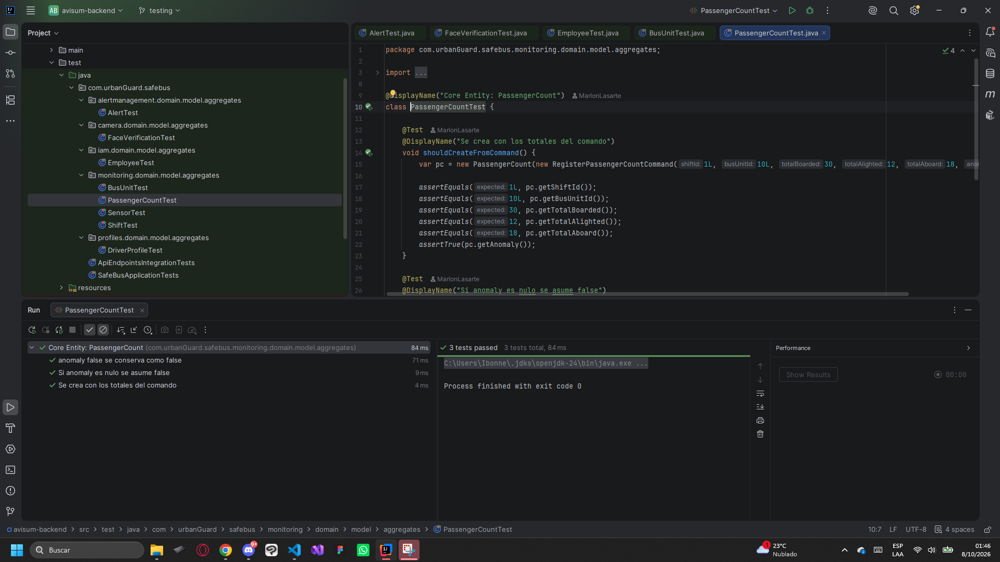

**Sensor Test**

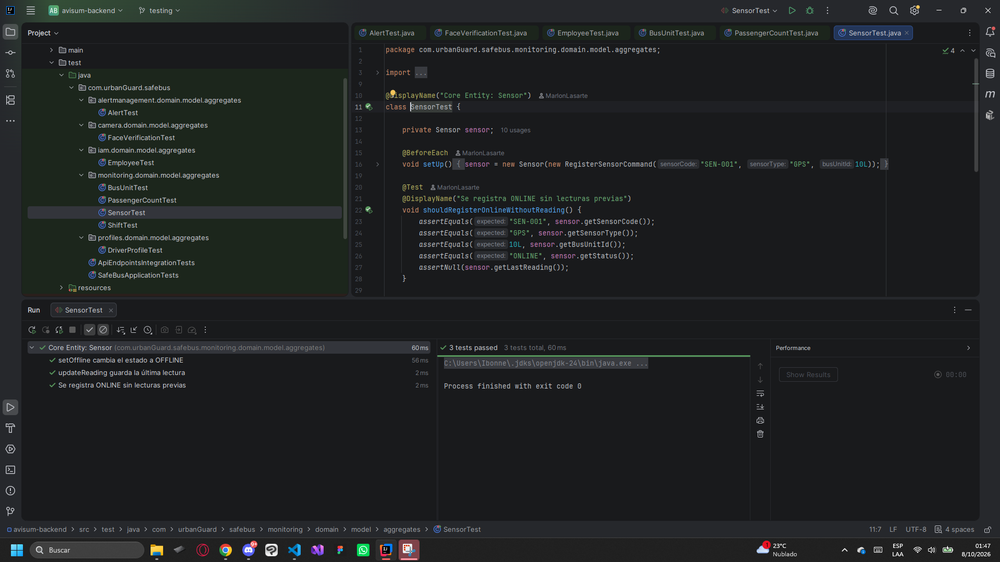

**Shift Test**

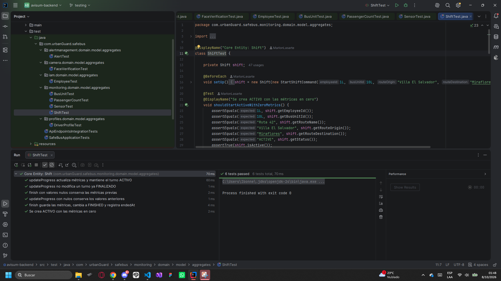

**Driver Profile Test**

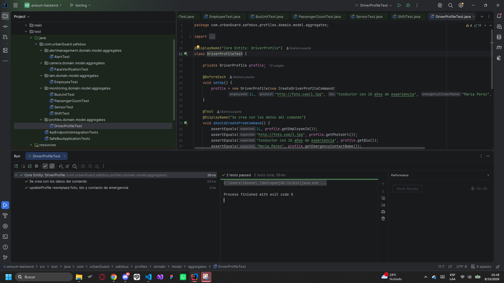

### 6.1.2. Core Integration Tests.

Las Core Integration Tests son esenciales para verificar que los controladores funcionen correctamente junto con otros componentes del sistema, como los servicios y las bases de datos. Además, permiten evaluar escenarios de error para comprobar que el sistema gestione adecuadamente situaciones inesperadas y devuelva los códigos de estado correspondientes. Esto contribuye a mejorar la experiencia del usuario, facilitar la detección de errores y garantizar un software más confiable y de calidad.

**Employees Api Integration Test**

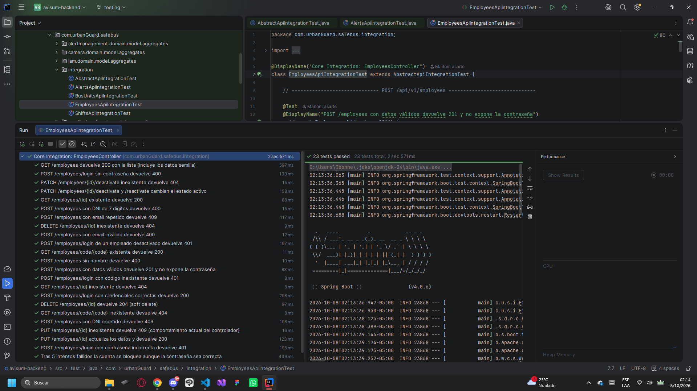

**Bus Units Api Integration Test**

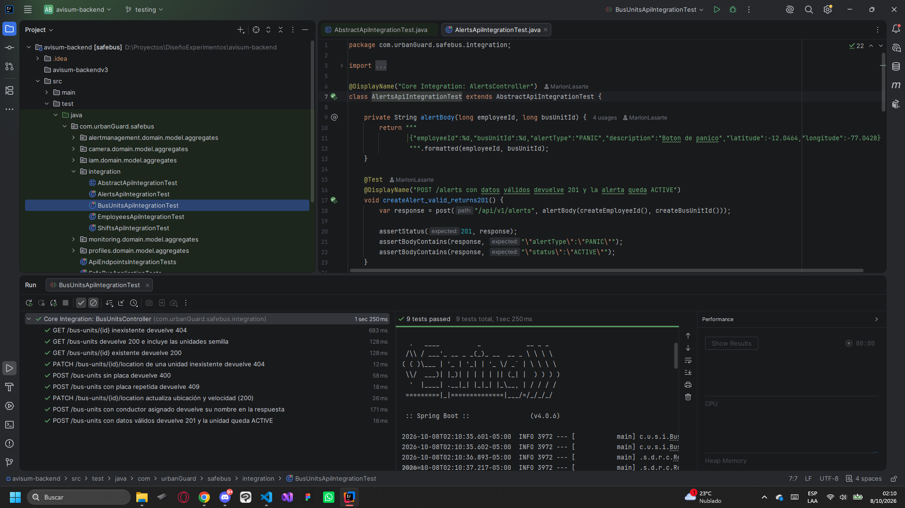

**Shifts Api Integration Test**

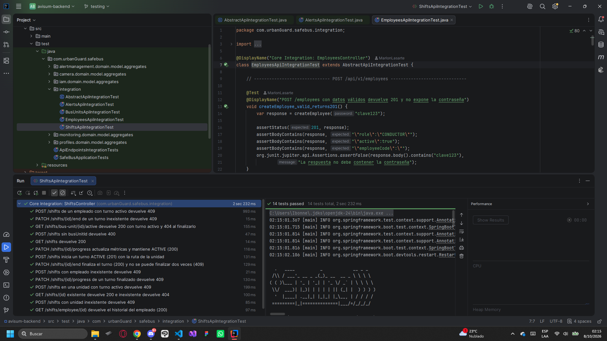

**Alerts Api Integration Test**

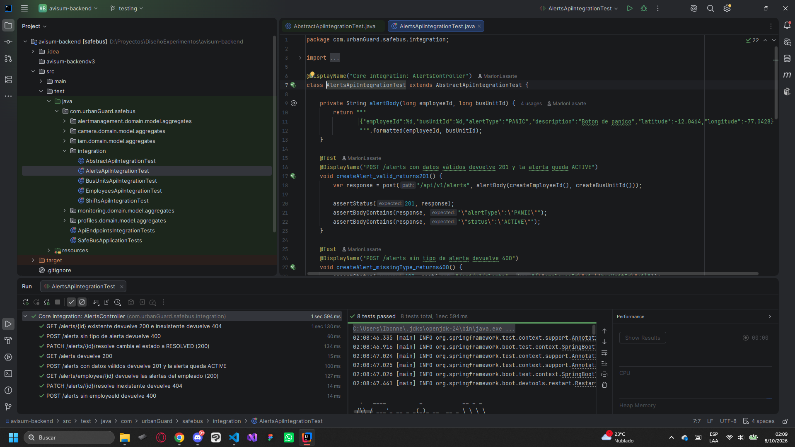

### 6.1.3. Core Behavior-Driven Development

El Behavior-Driven Development (BDD) permite validar el comportamiento del sistema a partir de escenarios que representan situaciones reales de uso. Estas pruebas ayudan a comprobar que las funcionalidades implementadas respondan correctamente a las necesidades definidas en los requerimientos, utilizando criterios claros y comprensibles para el equipo de desarrollo y los usuarios.

### 6.1.4. Core System Tests.

Las Core System Tests permiten evaluar el funcionamiento completo del sistema, verificando la interacción entre sus principales componentes y funcionalidades. Estas pruebas buscan comprobar que el producto cumpla con los requerimientos establecidos y que los flujos principales se ejecuten correctamente en escenarios similares a los de un entorno real.
