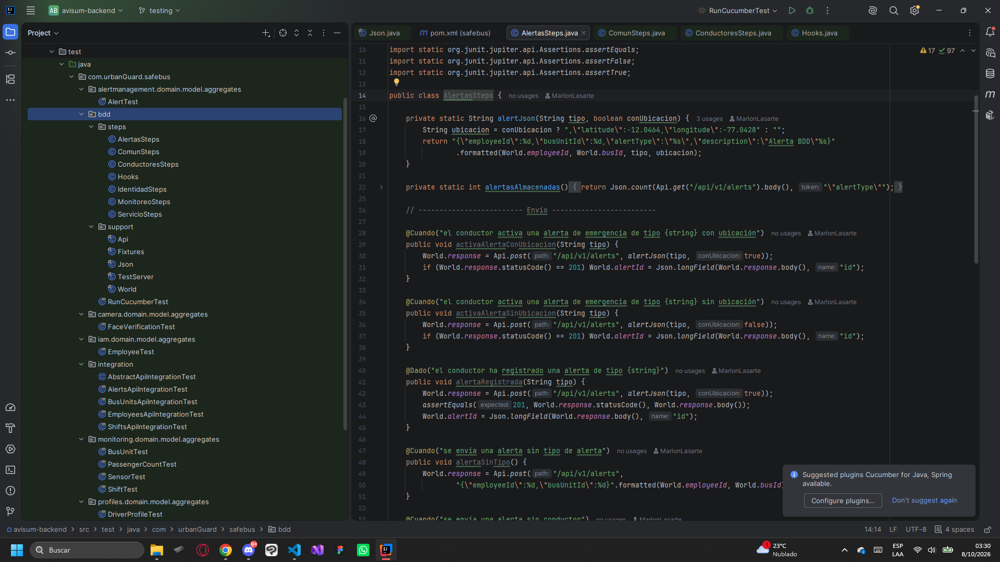
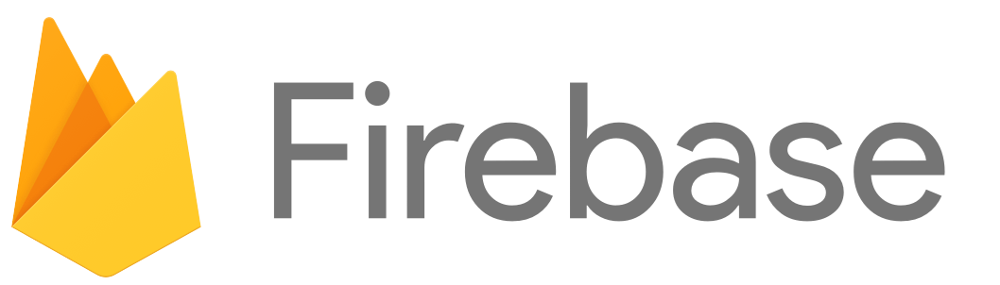

# Capítulo VII: DevOps Practices
## 7.1. Continuous Integration
### 7.1.1. Tools and Practices.
En el desarrollo y las pruebas de software, es fundamental utilizar herramientas y metodologías que permitan garantizar la calidad del código y mejorar la productividad del equipo. Para ello, se emplearon diversas herramientas orientadas tanto a la implementación como a la validación del funcionamiento y comportamiento esperado de la aplicación. Estas abarcan diferentes etapas del ciclo de vida del software, desde la programación y gestión del código hasta la ejecución de pruebas y la automatización de procesos.

Se aplicaron las metodologías de Desarrollo Orientado por Comportamiento (BDD) y Desarrollo Orientado por Pruebas (TDD), con el propósito de garantizar que las soluciones desarrolladas cumplan con los requerimientos establecidos y mantengan un adecuado nivel de calidad técnica. Para ello, se utilizaron diversas herramientas que facilitaron tanto el desarrollo como la validación del software. Entre las principales se encuentran:

|Herramienta|Tipo|Descripción|Propósito|
| :--: | :--: | :--: | :--:|
|J Unit| Herramienta para puebas (TDD)| Es un programa que ayuda a probar pequeñas partes de aplicaciones en Java| Hace más facil crear y ejecutar pruebas para asegurarse de que las funciones de los componentes funcionen como deberían.|
|Cucumber|Herramienta de BDD| Ayuda a desarrollar programas centrándose ene l comportamiento usando Gherkin para escribir ejemplos que todos entiendan.| Crea y prueba ejemplos basados en cómo debería comportarse el sistema, asegurando que el desarrollo esté alineado con lo que necesita el negocio|

### 7.1.2. Build & Test Suite Pipeline Components.

## 7.2. Continuos Delivery
### 7.2.1. Tools and Practices.
Su objetivo es automatizar la integración y ejecución de pruebas del código, asegurando que el proyecto se mantenga preparado para realizar un despliegue cuando sea necesario.

**Tools:**

**GitHub Actions / GitLab CLI:** Permiten automatizar el pipeline de CI/CD y configurar diferentes etapas de validación. En Continuous Delivery, el pipeline puede preparar y validar el software para su despliegue, dejando la publicación en producción sujeta a una aprobación manual.

**Jira:** Se utiliza para organizar y gestionar el proceso de aprobación del despliegue. Después de completar las validaciones del pipeline, el responsable del proyecto puede revisar los resultados y autorizar el paso a producción.

**Docker:** Permite contenerizar la aplicación y mantener entornos consistentes entre desarrollo, pruebas y producción. También facilita la validación de la aplicación en ambientes intermedios, como staging.

**Practices (Prácticas):**

**Feature Branching y Merge Requests:** Las nuevas funcionalidades y modificaciones se desarrollan en ramas independientes. Una vez superadas las pruebas y revisiones correspondientes, los cambios se integran en una rama estable, mientras que el despliegue a producción puede requerir una aprobación manual.

**Pipeline de Validación en Staging:** Antes del despliegue a producción, los cambios pasan por un entorno de staging que reproduce condiciones similares a las del entorno final. Esto permite realizar pruebas adicionales y verificar el correcto funcionamiento de la aplicación.

**Despliegue Semiautomático:** El pipeline automatiza la preparación y validación de la aplicación, pero el despliegue final a producción se ejecuta únicamente después de recibir la aprobación de un responsable.

**Aprobación Manual:** Antes de publicar una nueva versión, un responsable revisa los resultados obtenidos durante las pruebas y autoriza el despliegue. Esta práctica permite reducir el riesgo de introducir cambios no deseados en producción.

**Rollback Manual:** En caso de detectar problemas después de un despliegue, el equipo puede revertir manualmente la aplicación a una versión estable anterior. Esto permite controlar el proceso de recuperación y minimizar el impacto de posibles errores.

### 7.2.2. Stages Deployment Pipeline Components.

**Integración Continua (CI):** Cuando se realiza un commit en una rama de desarrollo, el pipeline ejecuta pruebas automatizadas y valida que la aplicación cumpla con las condiciones necesarias para su despliegue. Esto permite mantener el código en un estado estable y preparado para avanzar a las siguientes etapas.

**Validación en Staging:** Antes de llegar a producción, el código se despliega en un entorno de staging donde se simulan condiciones similares a las del entorno final. En esta etapa pueden realizarse pruebas adicionales, como pruebas manuales, de carga y de seguridad.

**Despliegue Manual:** Aunque la aplicación se encuentre completamente preparada, el despliegue hacia producción requiere la aprobación de una persona responsable. Esto permite realizar una última revisión antes de poner los cambios a disposición de los usuarios.

**Monitoreo y Feedback:** El pipeline incorpora mecanismos de monitoreo y análisis que permiten evaluar el comportamiento y rendimiento de la aplicación durante las etapas previas al despliegue definitivo. La información obtenida facilita la identificación de posibles problemas y la toma de decisiones.

**Aprobación del Despliegue:** El pipeline permanece en espera hasta que un desarrollador, administrador o responsable de operaciones revise los resultados de las validaciones y autorice el despliegue a producción.

## 7.3. Continuos deployment. 
El objetivo del Continuous Deployment (CD) es automatizar el proceso de despliegue de los cambios aprobados, llevando cada nueva versión desde el entorno de desarrollo hasta producción sin intervención manual, siempre que supere satisfactoriamente todas las pruebas y validaciones establecidas.

### 7.3.1. Tools and Practices.
En este apartado se presentan las herramientas y prácticas utilizadas para garantizar un proceso de despliegue automatizado, estable y confiable en el entorno de producción.

**Tools (Herramientas):**

* **GitHub Actions / GitLab CI:** Permiten automatizar el pipeline de CI/CD mediante workflows que ejecutan pruebas, construyen la aplicación y gestionan su despliegue en los diferentes entornos, como desarrollo, staging y producción.

* **Docker:** Se utiliza para contenerizar la aplicación backend desarrollada con Spring Boot, incluyendo sus dependencias y configuración. Esto permite mantener mayor consistencia entre los diferentes entornos de ejecución.

* **Railway:** Se utiliza como plataforma para alojar la base de datos MySQL, facilitando su administración y permitiendo integrar procesos relacionados con el despliegue y mantenimiento de la información.

* **Render:** Se emplea para realizar el despliegue del backend desarrollado con Spring Boot, permitiendo automatizar la publicación de nuevas versiones y facilitar el monitoreo de la aplicación.

* **Firebase Hosting:** Se utiliza para alojar el frontend desarrollado con Angular y automatizar su publicación, proporcionando un proceso de despliegue rápido y accesible.

**Practices (Prácticas):**

* **Feature Branching:** Se utiliza una estrategia de ramas en Git donde cada nueva funcionalidad o modificación se desarrolla de manera independiente. Una vez completada y validada, la rama se integra con la rama `develop`, permitiendo mantener un flujo de trabajo organizado.

* **Commit-based Deployment (Despliegue basado en commits):** Cada vez que se realiza un commit en la rama `develop`, el pipeline de CI/CD se activa automáticamente para ejecutar las etapas de construcción, pruebas y despliegue. Esto permite mantener un flujo de trabajo continuo y automatizado.

* **Rollback Automático:** En caso de detectar errores durante o después del despliegue en producción, el proceso puede restaurar una versión estable anterior de la aplicación. Esto permite reducir el impacto de los fallos y facilitar una recuperación rápida del servicio.

### 7.3.2. Production Deployment Pipeline Components.

Este apartado describe los principales componentes que conforman el pipeline de despliegue a producción y la manera en que se integran para automatizar el proceso.

**Componentes del Pipeline de la Base de Datos (Railway):**

Este pipeline gestiona el despliegue y actualización de la base de datos MySQL alojada en Railway.

1. **Gestión de Migraciones Automáticas:** Los cambios realizados en el modelo de datos del backend se reflejan mediante migraciones que mantienen sincronizada la estructura de la base de datos con las modificaciones realizadas en el código.

2. **Backup Automático:** Se generan copias de seguridad de la información antes de realizar cambios importantes en la base de datos. Esto permite recuperar una versión anterior en caso de producirse algún inconveniente durante una migración.

3. **Monitoreo de la Base de Datos:** Railway permite supervisar el estado y rendimiento de la base de datos después de aplicar los cambios. Ante posibles errores o comportamientos anómalos, se pueden identificar oportunamente para tomar las medidas correspondientes.

4. **Validación de Esquema:** Después de ejecutar las migraciones, se realizan validaciones para comprobar que las tablas, columnas y relaciones se hayan actualizado correctamente y que el esquema mantenga la estructura esperada.

5. **Despliegue Continuo:** Una vez completadas y validadas las migraciones, los cambios quedan disponibles en el entorno de producción, manteniendo un proceso de actualización continuo.

**Componentes del Pipeline del Backend (Render para Spring Boot):**

1. **Integración Continua:** Cuando se realiza un commit en la rama `develop`, Render obtiene la versión actualizada del backend desarrollado con Spring Boot y ejecuta el proceso de construcción mediante Maven.

2. **Construcción de la Imagen Docker:** Se genera una imagen Docker que contiene la aplicación y sus dependencias necesarias para ejecutarse correctamente en el entorno de producción.

3. **Despliegue:** Una vez finalizada la construcción, Render implementa la nueva versión del backend en el entorno de producción.

4. **Monitoreo y Alertas:** Después del despliegue, se supervisa el funcionamiento de la aplicación para detectar posibles errores o problemas de rendimiento que puedan requerir la intervención del equipo.

**Componentes del Pipeline del Frontend (Firebase para Angular):**

1. **Compilación del Frontend:** Al detectar una nueva versión del código, se ejecuta el proceso de compilación de la aplicación Angular en modo producción, generando los archivos necesarios para su publicación.

2. **Ejecución de Pruebas Automatizadas:** Se ejecutan pruebas unitarias y pruebas End-to-End (E2E) para verificar que las principales funcionalidades de la interfaz funcionen correctamente.

3. **Despliegue en Firebase Hosting:** Si las validaciones se completan satisfactoriamente, la nueva versión de la aplicación se publica automáticamente mediante Firebase Hosting, permitiendo su distribución a los usuarios.

4. **Invalidación de Caché:** Se actualiza la caché asociada al sitio para garantizar que los usuarios puedan acceder a la versión más reciente de la aplicación después del despliegue.

